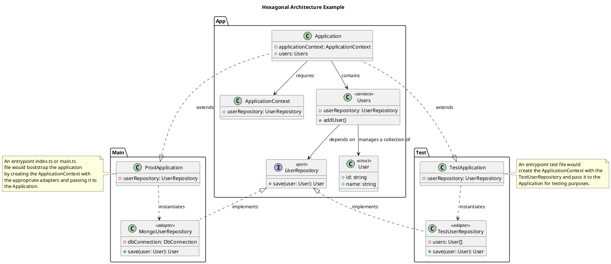

## Context

As applications grow, domain logic becomes entangled with infrastructure — database clients imported in business logic, environment variables read mid-workflow, HTTP frameworks shaping domain types. This makes the code hard to test, hard to reason about, and impossible to run outside its production environment.

This ADR establishes hexagonal architecture (ports and adapters) as the structural pattern for this codebase. It defines where domain logic lives, how it interacts with the outside world, and how the system is wired together.

This ADR complements GEN-002 (function design) and GEN-003 (error handling). GEN-002 governs function-level design — scope, purity, direction. This ADR governs module-level structure — what depends on what and where wiring happens.




## Decision

### Core principle

Domain logic must be pure and independent of frameworks, I/O, databases, network, and UI. All external interactions flow through ports (interfaces), implemented by adapters.

### Ports

A port is a TypeScript interface that describes what the domain needs from the outside world or what the outside world can ask of the domain. Ports live in `src/app/` alongside the domain logic that depends on them.

Ports must:

- Be small and purpose-driven — one port per capability, not one port per infrastructure technology.
- Use domain-shaped inputs and outputs — never database rows, HTTP request objects, or framework types.
- Be consistent in sync/async — if any method is async, all methods on the port should be async.
- Be named for what they do, not how they do it. `UserRepository`, not `MongoUserStore`. `Clock`, not `SystemDateProvider`.

```ts
interface UserRepository {
  save(user: User): ResultAsync<User, UserPersistenceError>;
  findById(id: UserId): ResultAsync<User | null, UserPersistenceError>;
}

interface Clock {
  now(): Date;
}
```

### Adapters

An adapter implements a port and translates between domain types and infrastructure types. Adapters live in `src/adapters/`.

Adapters must:

- Implement exactly one port.
- Contain no business logic or policy decisions — only translation and delegation to the underlying technology.
- Translate infrastructure errors into domain errors (see GEN-003).
- Be replaceable — swapping an adapter must not require changes to any domain code.

```ts
// src/adapters/MongoUserRepository.ts
class MongoUserRepository implements UserRepository {
  constructor(private readonly db: Db) {}

  save(user: User): ResultAsync<User, UserPersistenceError> {
    return ResultAsync.fromPromise(
      this.db.collection("users").insertOne(toDocument(user)),
      (e) => new UserPersistenceError("save", { cause: e })
    ).map(() => user);
  }
}
```

### Services

Services contain domain logic. They live in `src/app/` and depend exclusively on port interfaces. Services must not import database clients, HTTP libraries, filesystem APIs, environment variables, loggers, or web framework types.

A service receives its port dependencies through its constructor or factory function — never by importing a concrete adapter.

```ts
// src/app/Users.ts
class Users {
  constructor(private readonly repo: UserRepository) {}

  addUser(name: string): ResultAsync<User, UserPersistenceError> {
    const user = User.create(name);
    return this.repo.save(user);
  }
}
```

### ApplicationContext

`ApplicationContext` is the dependency container. It is a plain object or class that holds the wired-together set of ports, adapters, and services for a given environment.

- Constructed once at the composition root.
- Passed downward — services receive only the dependencies they need, not the entire context.
- Never imported as a module-level singleton.

```ts
// src/app/ApplicationContext.ts
interface ApplicationContext {
  readonly users: Users;
}

function createApplicationContext(deps: { userRepository: UserRepository }): ApplicationContext {
  return {
    users: new Users(deps.userRepository),
  };
}
```

### Single composition root

There is exactly one production entrypoint (`src/main.ts`) that instantiates adapters, builds the `ApplicationContext`, and wires the system. No other module may directly create infrastructure adapters or read environment variables.

```ts
// src/main.ts
const db = await connectMongo(process.env.MONGO_URI!);
const userRepository = new MongoUserRepository(db);
const app = createApplicationContext({ userRepository });
```

Environment variables, connection strings, and configuration are read here and nowhere else. Configuration flows downward from the entrypoint — never upward from a module-level global.

### No hidden globals

No module-level singletons for repositories, connections, loggers, or configuration. Every dependency is explicitly constructed at the composition root and passed to where it is needed.

## Testing

The hexagonal structure enables a testing strategy where domain logic is tested without infrastructure.

### Test composition root

Tests create their own `ApplicationContext` using in-memory or fake adapters. This is the test equivalent of `src/main.ts`.

```ts
// src/__tests__/TestApplication.ts
class InMemoryUserRepository implements UserRepository {
  private users: User[] = [];

  save(user: User): ResultAsync<User, UserPersistenceError> {
    this.users.push(user);
    return okAsync(user);
  }
}

const testApp = createApplicationContext({
  userRepository: new InMemoryUserRepository(),
});
```

### Testing rules

- **Never mock domain services.** If you need to control behavior, substitute the port with a fake adapter — that is the entire point of the architecture.
- **Sociable tests dominate.** Test multiple services collaborating through real domain logic with fake adapters. This gives maximum coverage of real behavior.
- **Adapter contract tests.** Write tests that verify a real adapter satisfies the port contract. Run these against real infrastructure (test database, test API) in CI.
- **Inject time and randomness.** Use `Clock` and `IdGenerator` ports rather than calling `Date.now()` or `crypto.randomUUID()` directly. Tests inject deterministic implementations.
- **No wall-clock dependencies.** Tests must not depend on real time. A test that sleeps or checks `Date.now()` is a test that will flake.

## Do's and Don'ts

### Do

- Define ports in `src/app/` using domain-shaped types.
- Implement adapters in `src/adapters/`, one adapter per port.
- Wire everything in a single composition root (`src/main.ts`).
- Pass dependencies downward — services receive only what they need.
- Create a test composition root with in-memory adapters for testing.
- Translate infrastructure errors into domain errors at the adapter boundary.

### Don't

- Don't import infrastructure clients (`mongodb`, `fs`, `fetch`, `Bun.$`) in `src/app/`.
- Don't create adapters inside services — receive them through constructors.
- Don't read environment variables outside the composition root.
- Don't create module-level singletons for repositories or connections.
- Don't pass the entire `ApplicationContext` to a service that only needs one port — destructure.
- Don't put business logic or policy decisions in adapters.
- Don't mock domain service internals in tests — substitute ports with fakes instead.

## Consequences

### Positive

- Domain logic is testable without any infrastructure running.
- Swapping a database, API client, or framework requires changing only an adapter — domain code is untouched.
- The composition root is the only place that knows how the system is wired, making the dependency graph explicit and auditable.
- Tests run fast because they use in-memory fakes instead of real databases.

### Negative

- More files and indirection — a simple database call now involves a port, an adapter, and a service.
- Developers must understand the port/adapter distinction and resist the urge to "just import the client."

### Risks

- **Leaky ports**: ports that expose infrastructure types (database cursors, HTTP response objects) defeat the purpose. Review ports for domain purity.
- **Anemic adapters**: if adapters contain complex logic, either the port contract is too broad or business logic has leaked out of the domain.
- **Over-porting**: not every function call needs a port. Ports are for boundaries where you need replaceability or testability — pure utility functions do not need ports.

## Compliance and Enforcement

- This ADR is marked `rules: true`. The `archgate check` command flags violations during CI and in editor pre-commit hooks.
- No file in `src/app/` may import from `src/adapters/` or from infrastructure packages directly.
- `process.env` access must be confined to the composition root.
- All port interfaces must live in `src/app/`.

## References

- Alistair Cockburn, [Hexagonal Architecture (Ports and Adapters)](https://alistair.cockburn.us/hexagonal-architecture/)
- Gary Bernhardt, ["Boundaries" (SCNA 2012)](https://www.destroyallsoftware.com/talks/boundaries) — Functional Core, Imperative Shell
- GEN-002 — Function Design: Single Responsibility and Orchestration Layers
- GEN-003 — Error Handling: Checked vs Unchecked Errors
- [Archgate CLI](https://github.com/archgate/cli)