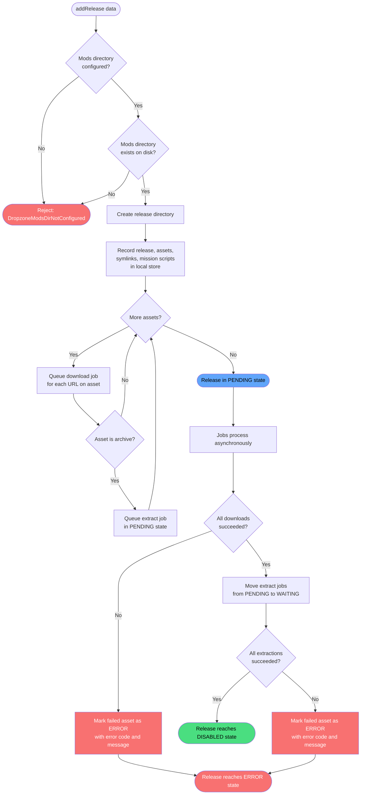

# Add Release

**Stable**

Adding a [release](#) registers it with the [Daemon](#) and begins downloading and extracting its assets so the [mod](#) can later be enabled in DCS World.

| Property      | Value                                                                        |
|---------------|------------------------------------------------------------------------------|
| Applies to    | Daemon                                                                       |
| Trigger       | User requests installation of a release from the [registry](#)              |
| Preconditions | The mods directory is configured and exists on disk                          |

## Inputs

`releaseId`
:   **String, required.** The identifier of the release to add.

`modId`
:   **String, required.** The identifier of the mod the release belongs to.

`modName`
:   **String, required.** The display name of the mod.

`version`
:   **String, required.** The version string of the release.

`assets`
:   **List, required.** The downloadable assets for this release. Each asset includes a name, one or more download URLs, and whether it is an archive that should be extracted after download.

`symbolicLinks`
:   **List, required.** The symlink definitions for this release. Each definition specifies a source path within the release, a destination path, and which DCS World root directory the destination is relative to.

`missionScripts`
:   **List, optional.** Mission script definitions bundled with the release. Each definition specifies a script path, where it should be placed, and when it should run.

`dependencies`
:   **List, optional.** Identifiers of other mods this release depends on.

### Assertions

| Assertion | Status |
|-----------|--------|
| The mods directory must be configured | <Badge type="tip" text="Implemented" /> |
| The mods directory must exist on disk | <Badge type="tip" text="Implemented" /> |

### Outputs

`Result<void, DropzoneModsDirNotConfigured>`
:   On success, returns `void`. On failure, returns the following error type:

`DropzoneModsDirNotConfigured`
:   The mods directory has not been configured or does not exist on disk. No release is recorded.

### Effects

| Effect | Status |
|--------|--------|
| A directory is created in the mods directory for the release | <Badge type="tip" text="Implemented" /> |
| The release, its assets, symlink definitions, and mission scripts are recorded in the Daemon's local store | <Badge type="tip" text="Implemented" /> |
| A download job is queued for each asset URL | <Badge type="tip" text="Implemented" /> |
| For each archive asset, an extract job is queued in `PENDING` state | <Badge type="tip" text="Implemented" /> |
| Extract jobs move to `WAITING` once all downloads complete | <Badge type="tip" text="Implemented" /> |
| On download failure, the failed asset is marked as `ERROR` with an error code and human-readable message | <Badge type="tip" text="Implemented" /> |
| On extraction failure, the failed asset is marked as `ERROR` with an error code and human-readable message | <Badge type="tip" text="Implemented" /> |

## Behavior

## See Also

- [Remove Release](/daemon/spec/remove-release) — Spec page for removing an added release from the Daemon.
- [Enable Release](/daemon/spec/enable-release) — Spec page for activating a release after it reaches the `DISABLED` state.
- [How the Daemon works](/guides/how-the-daemon-works) — Guide covering the download and extraction pipeline.
- [How the Webapp works](/guides/how-the-webapp-works) — How release metadata and assets are published to the registry.
