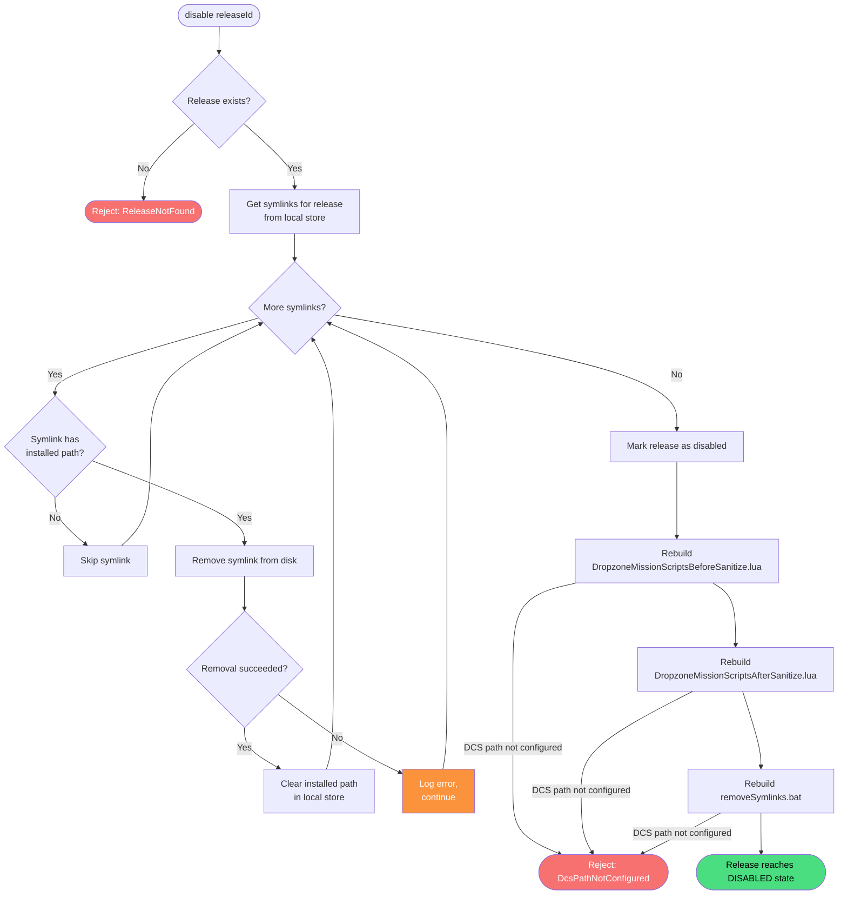

# Disable Release

**Stable**

Disabling a [release](#) deactivates the [mod](#) in DCS World by removing the [symlinks](#) that were created when the release was enabled, and rebuilding the [mission scripting files](#) and [remove-symlinks script](#) to exclude the release.

| Property      | Value                                                              |
|---------------|--------------------------------------------------------------------|
| Applies to    | Daemon                                                             |
| Trigger       | User requests that an enabled release be deactivated in DCS World  |
| Preconditions | The release has been enabled                                       |

## Inputs

`releaseId`
:   **String, required.** The identifier of the release to disable.

### Assertions

| Assertion | Status |
|-----------|--------|
| The release must exist in the Daemon's local store | <Badge type="tip" text="Implemented" /> |

### Outputs

`Result<void, ReleaseToggleError>`
:   On success, returns `void`. On failure, returns one of the following error types:

`ReleaseNotFound`
:   The release does not exist in the Daemon's local store.

`DcsPathNotConfigured`
:   The DCS path required to rebuild the mission scripting files and remove-symlinks script has not been configured.

`DropzoneModsDirNotConfigured`
:   The mods directory has not been configured or does not exist on disk.

### Effects

| Effect | Status |
|--------|--------|
| Symlinks are removed from disk using the installed paths stored in the Daemon's local store | <Badge type="tip" text="Implemented" /> |
| The installed path of each removed symlink is cleared from the Daemon's local store | <Badge type="tip" text="Implemented" /> |
| If a symlink cannot be removed, the error is logged and the remaining symlinks are still processed | <Badge type="tip" text="Implemented" /> |
| The release is marked as disabled in the Daemon's local store | <Badge type="tip" text="Implemented" /> |
| `Scripts/DropzoneMissionScriptsBeforeSanitize.lua` is rebuilt to exclude before-sanitize mission scripts from this release | <Badge type="tip" text="Implemented" /> |
| `Scripts/DropzoneMissionScriptsAfterSanitize.lua` is rebuilt to exclude after-sanitize mission scripts from this release | <Badge type="tip" text="Implemented" /> |
| `removeSymlinks.bat` is rebuilt to exclude the removed symlinks | <Badge type="tip" text="Implemented" /> |

## Behavior

## See Also

- [Enable Release](/daemon/spec/enable-release) — Spec page for activating a release in DCS World.
- [Remove Release](/daemon/spec/remove-release) — Spec page for fully removing a release from the Daemon.
- [Add Release](/daemon/spec/add-release) — Spec page for downloading a release before it can be enabled.
- [How the Daemon works](/guides/how-the-daemon-works) — Guide covering the symlink mechanism and mission scripting files.
