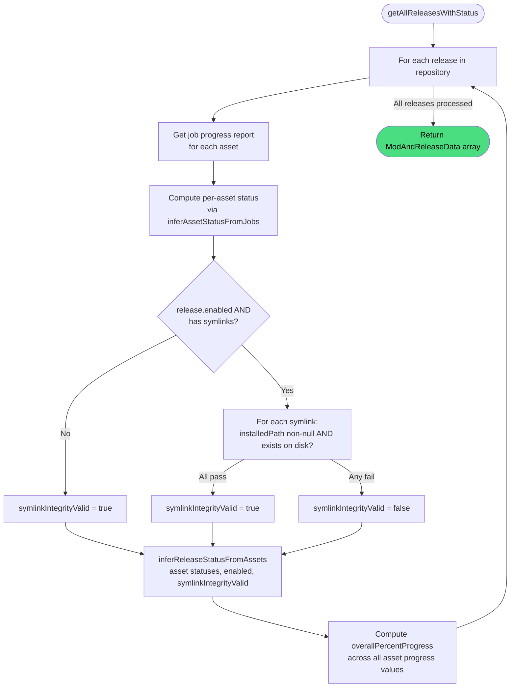

# Get all releases

**Stable**

Getting all releases returns every [release](#) registered with the [Daemon](#), each with a derived `status` computed from live job state and a symlink integrity check, and an `overallPercentProgress` across all assets.

| Property      | Value                                               |
|---------------|-----------------------------------------------------|
| Applies to    | Daemon                                              |
| Trigger       | Client polls for the current state of all releases  |
| Preconditions | None                                                |

## Inputs

There are no inputs.

### Assertions

| Assertion | Status |
|-----------|--------|
| None — the operation always returns a result, even if no releases are registered | |

### Outputs

`ModAndReleaseData[]`
:   One entry per registered release. Each entry includes all stored release metadata, the asset list with per-asset `statusData`, symlink definitions, mission scripts, a derived `status`, and an `overallPercentProgress`.

### Effects

None. This is a read-only operation. The symlink integrity check reads the filesystem but does not modify it.

## Status derivation

Release status is computed in two layers.

### Layer 1 — per-asset status (`inferAssetStatusFromJobs`)

Each asset's status is derived from its download and extract job states:

| Condition | Asset status |
|---|---|
| Any download or extract job is `Failed` | `ERROR` |
| All download and extract jobs are `Pending` | `PENDING` |
| All download and extract jobs are `Success` | `COMPLETED` |
| Otherwise (mix of states, or jobs running) | `IN_PROGRESS` |

If an asset has no job records, its status defaults to `PENDING`.

### Layer 2 — release status (`inferReleaseStatusFromAssets`)

The per-asset statuses and the release's `enabled` flag are combined:

| Condition | Release status |
|---|---|
| All assets `PENDING` (and list non-empty) | `PENDING` |
| Any asset `ERROR` | `ERROR` |
| All assets `COMPLETED`, `enabled=true`, symlinks invalid | `INCONSISTENT` |
| All assets `COMPLETED`, `enabled=true` | `ENABLED` |
| All assets `COMPLETED`, `enabled=false` | `DISABLED` |
| Otherwise | `IN_PROGRESS` |

### Symlink integrity check

The check only runs when `enabled=true` and the release has at least one symlink definition. Every symlink must have a non-null `installedPath` that exists on disk. Any symlink with a null `installedPath`, or whose path does not exist (including filesystem errors), causes `symlinkIntegrityValid=false` and the status becomes `INCONSISTENT`.

This detects mods that were enabled but whose symlinks were subsequently removed externally — for example by a manual cleanup or a DCS World update.

## Behavior

## See Also

- [Add Release](/daemon/spec/add-release) — Spec page for registering a release, which transitions it to `PENDING`.
- [Enable Release](/daemon/spec/enable-release) — Spec page for the operation that transitions a release to `ENABLED`.
- [Disable Release](/daemon/spec/disable-release) — Spec page for the operation that transitions a release to `DISABLED`.
- [Remove Release](/daemon/spec/remove-release) — Spec page for removing a release entirely.
- [How the Daemon works](/guides/how-the-daemon-works) — Guide covering the download pipeline and symlink mechanism.
