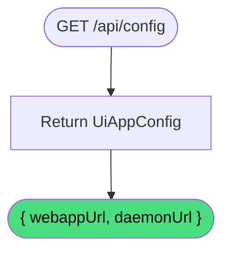

# Get config

**Stable**

Getting the config returns the [Daemon's](#) build-time UI configuration — the URLs the browser-side UI needs to communicate with the [Daemon](#) and the [Webapp](#).

| Property      | Value                                               |
|---------------|-----------------------------------------------------|
| Applies to    | Daemon                                              |
| Trigger       | Client requests the application configuration       |
| Preconditions | None                                                |

## Inputs

There are no inputs.

### Assertions

| Assertion | Status |
|-----------|--------|
| None — the operation always succeeds | |

### Outputs

`UiAppConfig`
:   An object with two fields:

`webappUrl`
:   **String.** The URL of the hosted Webapp.

`daemonUrl`
:   **String.** The URL this Daemon instance is listening on.

### Effects

None. This is a read-only operation returning static build-time values.

## Behavior

## See Also

- [Get health](/daemon/spec/get-health) — Spec page for checking whether the Daemon is operational.
