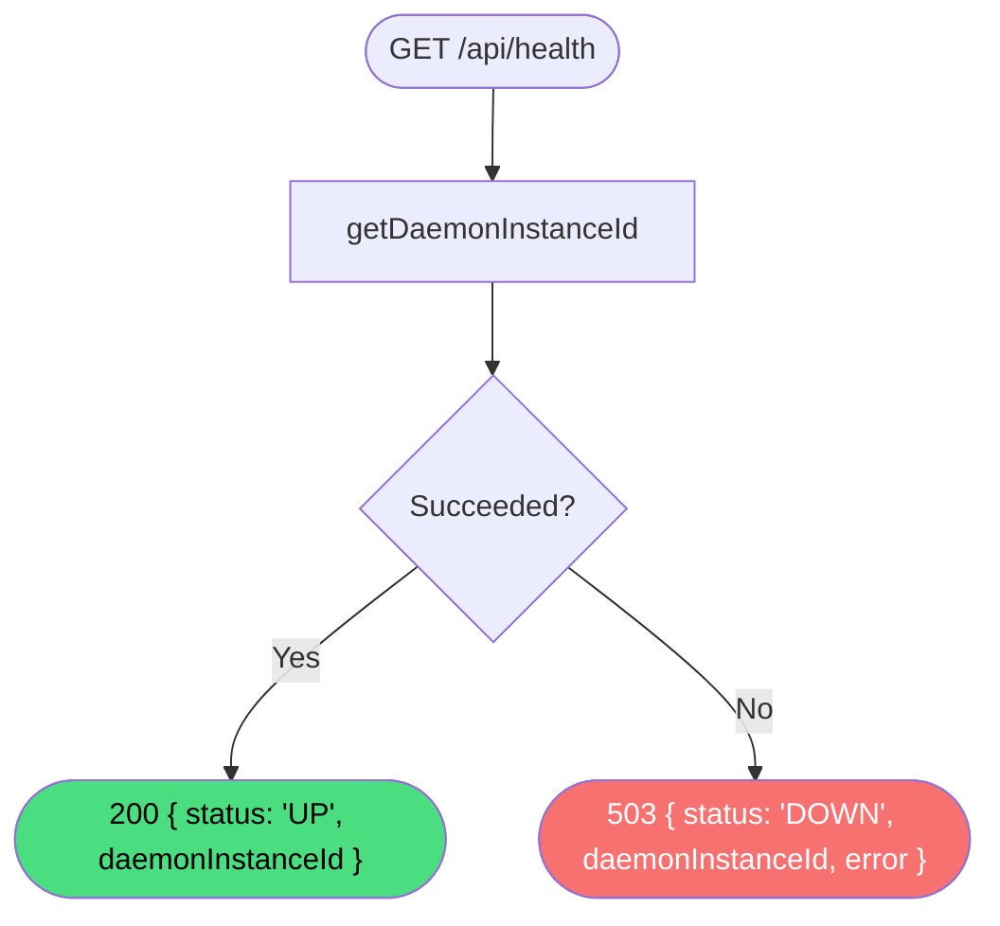

# Get Health

**Stable**

Getting the health status checks whether the [Daemon](#) is operational and returns its instance identifier. The check is a lightweight probe; any unexpected error during the check causes the Daemon to report itself as unavailable.

| Property      | Value                                                    |
|---------------|----------------------------------------------------------|
| Applies to    | Daemon                                                   |
| Trigger       | Client polls `GET /api/health` to verify the Daemon is running |
| Preconditions | None                                                     |

## Inputs

There are no inputs.

### Assertions

| Assertion | Status |
|-----------|--------|
| None — the operation always returns a response | |

### Outputs

`{ status: "UP", daemonInstanceId: string }`
:   Returned with `200 OK` when the Daemon is healthy.

`{ status: "DOWN", daemonInstanceId: string, error: string }`
:   Returned with `503 Service Unavailable` when an unexpected error occurs during the health check.

### Effects

None.

## Behavior

## See Also

- [Get config](/daemon/spec/get-config) — Spec page for retrieving the Daemon's UI configuration.
