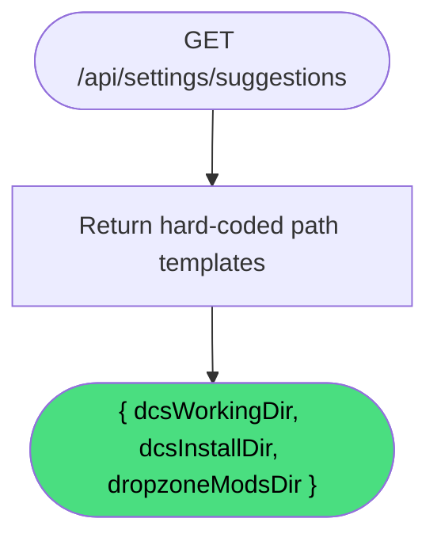

# Get Settings Suggestions

**Stable**

Getting settings suggestions returns the recommended default path values for each setting field. The suggestions are platform-appropriate path templates that the UI can pre-populate into the settings form.

| Property      | Value                                                           |
|---------------|-----------------------------------------------------------------|
| Applies to    | Daemon                                                          |
| Trigger       | Client requests suggested default values for the settings form  |
| Preconditions | None                                                            |

## Inputs

There are no inputs.

### Assertions

| Assertion | Status |
|-----------|--------|
| None — the operation always succeeds | |

### Outputs

`{ dcsWorkingDir?, dcsInstallDir?, dropzoneModsDir? }`
:   An object with the three suggested path strings. All fields are optional strings. The current implementation always returns all three.

The suggested values are Windows path templates using environment variable placeholders:

| Field | Suggested value |
|---|---|
| `dcsWorkingDir` | `%USERPROFILE%\Saved Games\DCS` |
| `dcsInstallDir` | `%PROGRAMFILES%\Eagle Dynamics\DCS World` |
| `dropzoneModsDir` | `%LOCALAPPDATA%\DCS Dropzone\Mods` |

> **Note:** These are suggestions only. The user may enter any path. Environment variable placeholders in the returned strings are not expanded — they are returned as-is for display in the UI.

### Effects

None. This is a read-only operation returning static values.

## Behavior

## See Also

- [Get settings](/daemon/spec/get-settings) — Spec page for reading the currently stored values.
- [Update settings](/daemon/spec/update-settings) — Spec page for writing new path values.
- [Validate settings](/daemon/spec/validate-settings) — Spec page for resolving and verifying configured paths on disk.
