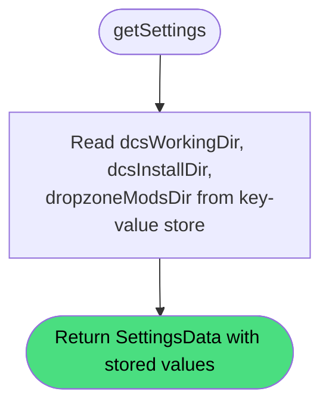

# Get Settings

**Stable**

Getting settings returns the path values that are explicitly stored in the [Daemon's](#) local store, without applying defaults or expanding environment variables.

| Property      | Value                                                  |
|---------------|--------------------------------------------------------|
| Applies to    | Daemon                                                 |
| Trigger       | Client requests the current path configuration         |
| Preconditions | None                                                   |

## Inputs

There are no inputs.

### Assertions

| Assertion | Status |
|-----------|--------|
| None — the operation always succeeds | |

### Outputs

`SettingsData`
:   An object with three optional string fields: `dcsWorkingDir`, `dcsInstallDir`, and `dropzoneModsDir`. A field is absent when no value has been stored for it, or when a previous [update settings](#) call explicitly cleared it.

### Effects

None. This is a read-only operation.

> **Note:** The returned values are the raw strings as stored — no environment variable expansion is applied and no platform defaults are substituted. To obtain resolved, validated paths, use [validate settings](/daemon/spec/validate-settings).

## Behavior

## See Also

- [Update settings](/daemon/spec/update-settings) — Spec page for writing new path values.
- [Validate settings](/daemon/spec/validate-settings) — Spec page for resolving and checking configured paths on disk.
