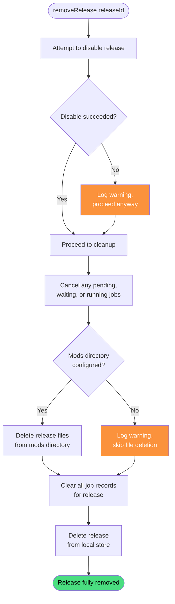

# Remove Release

**Stable**

Removing a [release](#) from the [Daemon](#) deactivates it if it is enabled, cancels any in-progress downloads or extractions, deletes the release's files from disk, and removes all records of the release from the Daemon's local store.

| Property      | Value                                                              |
|---------------|--------------------------------------------------------------------|
| Applies to    | Daemon                                                             |
| Trigger       | User requests that a previously added release be removed           |
| Preconditions | The release has been added to the Daemon                           |

## Inputs

`releaseId`
:   **String, required.** The identifier of the release to remove.

### Assertions

| Assertion | Status |
|-----------|--------|
| None — removal proceeds regardless of the release's current state | |

### Outputs

`void`
:   The operation always completes. Disable failures (e.g. DCS path not configured) are logged as warnings but do not prevent removal.

### Effects

| Effect | Status |
|--------|--------|
| If the release is enabled, symlinks are removed from disk using installed paths stored in the Daemon's local store | <Badge type="tip" text="Implemented" /> |
| If the release is enabled and the DCS path is configured, `Scripts/DropzoneMissionScriptsBeforeSanitize.lua` is rebuilt | <Badge type="tip" text="Implemented" /> |
| If the release is enabled and the DCS path is configured, `Scripts/DropzoneMissionScriptsAfterSanitize.lua` is rebuilt | <Badge type="tip" text="Implemented" /> |
| If the release is enabled and the DCS path is configured, `removeSymlinks.bat` is rebuilt | <Badge type="tip" text="Implemented" /> |
| If the DCS path is not configured, the disable step logs a warning and proceeds with cleanup | <Badge type="tip" text="Implemented" /> |
| Any in-progress or queued download and extract jobs are cancelled | <Badge type="tip" text="Implemented" /> |
| The release's files are deleted from the mods directory | <Badge type="tip" text="Implemented" /> |
| If the mods directory is not configured, file deletion is skipped without blocking removal | <Badge type="tip" text="Implemented" /> |
| All job records associated with the release are cleared | <Badge type="tip" text="Implemented" /> |
| The release is removed from the Daemon's local store | <Badge type="tip" text="Implemented" /> |

## Behavior

## See Also

- [Add Release](/daemon/spec/add-release) — Spec page for registering a release with the Daemon.
- [Disable Release](/daemon/spec/disable-release) — Spec page for the disable step that removal invokes.
- [Enable Release](/daemon/spec/enable-release) — Spec page for the enable behavior that removal reverses.
- [How the Daemon works](/guides/how-the-daemon-works) — Guide covering the download pipeline and symlink management.
