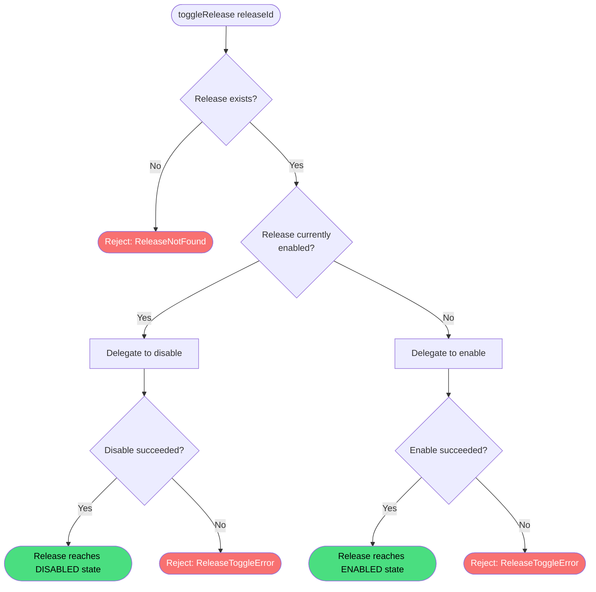

# Toggle Release

**Stable**

Toggling a [release](#) switches its active state in DCS World: if the release is currently disabled, toggling it enables it; if it is currently enabled, toggling it disables it.

| Property      | Value                                                                          |
|---------------|--------------------------------------------------------------------------------|
| Applies to    | Daemon                                                                         |
| Trigger       | User requests a state change on a release without specifying the target state  |
| Preconditions | The release has been added and all download and extract jobs have completed    |

## Inputs

`releaseId`
:   **String, required.** The identifier of the release to toggle.

### Assertions

| Assertion | Status |
|-----------|--------|
| The release must exist in the Daemon's local store | <Badge type="tip" text="Implemented" /> |
| If enabling: the release must be ready — all download and extract jobs must have completed | <Badge type="tip" text="Implemented" /> |
| If enabling: the mods directory must be configured and exist on disk | <Badge type="tip" text="Implemented" /> |
| If enabling: the DCS path must be configured for each symlink destination root referenced by the release | <Badge type="tip" text="Implemented" /> |

### Outputs

`Result<void, ReleaseToggleError>`
:   On success, returns `void`. On failure, returns one of the following error types:

`ReleaseNotFound`
:   The release does not exist in the Daemon's local store.

`ReleaseNotReady`
:   The release has incomplete download or extract jobs. Only returned when toggling from disabled to enabled.

`DropzoneModsDirNotConfigured`
:   The mods directory has not been configured or does not exist on disk. Only returned when toggling from disabled to enabled.

`DcsPathNotConfigured`
:   The DCS path required to resolve symlink destinations has not been configured. Returned when toggling in either direction if the DCS path is needed to rebuild mission scripting files.

`SymlinkCreationFailed`
:   A symlink could not be created on disk. Only returned when toggling from disabled to enabled.

### Effects

The effects depend on the direction of the toggle.

**When enabling (disabled → enabled):**

| Effect | Status |
|--------|--------|
| Symlinks are created on disk in the DCS World directories | <Badge type="tip" text="Implemented" /> |
| The installed path of each created symlink is recorded in the Daemon's local store | <Badge type="tip" text="Implemented" /> |
| The release is marked as enabled in the Daemon's local store | <Badge type="tip" text="Implemented" /> |
| `Scripts/DropzoneMissionScriptsBeforeSanitize.lua` is rebuilt to include before-sanitize mission scripts from this release | <Badge type="tip" text="Implemented" /> |
| `Scripts/DropzoneMissionScriptsAfterSanitize.lua` is rebuilt to include after-sanitize mission scripts from this release | <Badge type="tip" text="Implemented" /> |
| `removeSymlinks.bat` is rebuilt to include the newly created symlinks | <Badge type="tip" text="Implemented" /> |
| On failure, all changes are rolled back | <Badge type="tip" text="Implemented" /> |

**When disabling (enabled → disabled):**

| Effect | Status |
|--------|--------|
| Symlinks are removed from disk using the installed paths stored in the Daemon's local store | <Badge type="tip" text="Implemented" /> |
| The installed path of each successfully removed symlink is cleared from the Daemon's local store | <Badge type="tip" text="Implemented" /> |
| If a symlink cannot be removed, a warning is logged and the installed path is left in place | <Badge type="tip" text="Implemented" /> |
| The release is marked as disabled in the Daemon's local store | <Badge type="tip" text="Implemented" /> |
| `Scripts/DropzoneMissionScriptsBeforeSanitize.lua` is rebuilt to exclude before-sanitize mission scripts from this release | <Badge type="tip" text="Implemented" /> |
| `Scripts/DropzoneMissionScriptsAfterSanitize.lua` is rebuilt to exclude after-sanitize mission scripts from this release | <Badge type="tip" text="Implemented" /> |
| `removeSymlinks.bat` is rebuilt to exclude the removed symlinks | <Badge type="tip" text="Implemented" /> |

## Behavior

## See Also

- [Enable Release](/daemon/spec/enable-release) — Spec page for the enable path that toggle invokes when the release is disabled.
- [Disable Release](/daemon/spec/disable-release) — Spec page for the disable path that toggle invokes when the release is enabled.
- [Add Release](/daemon/spec/add-release) — Spec page for downloading a release before it can be toggled.
- [Remove Release](/daemon/spec/remove-release) — Spec page for fully removing a release from the Daemon.
- [How the Daemon works](/guides/how-the-daemon-works) — Guide covering the symlink mechanism and mission scripting files.
