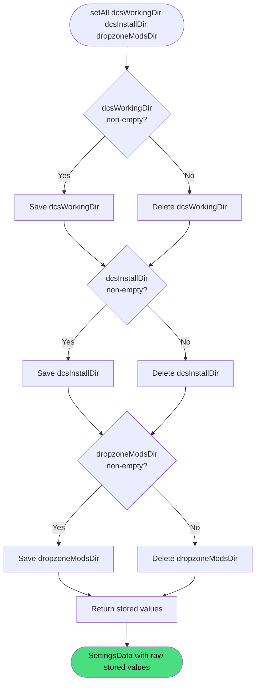

# Update Settings

**Stable**

Updating settings replaces the [Daemon's](#) stored path configuration. Each field in the request is written if non-empty, or deleted from the store if empty or absent. The stored values after the write are returned.

| Property      | Value                                                        |
|---------------|--------------------------------------------------------------|
| Applies to    | Daemon                                                       |
| Trigger       | User submits new path values in the settings form            |
| Preconditions | None                                                         |

## Inputs

`dcsWorkingDir`
:   **String, optional.** Path to the DCS World saved games directory. If empty or absent, the stored value is deleted.

`dcsInstallDir`
:   **String, optional.** Path to the DCS World installation directory. If empty or absent, the stored value is deleted.

`dropzoneModsDir`
:   **String, optional.** Path to the DCS Dropzone mods directory. If empty or absent, the stored value is deleted.

### Assertions

| Assertion | Status |
|-----------|--------|
| None — any combination of values (including all empty) is accepted | |

### Outputs

`SettingsData`
:   The raw stored values after the write. Fields that were cleared are absent from the response. No defaults are applied and no environment variable expansion is performed.

### Effects

| Effect | Status |
|--------|--------|
| Each non-empty field value is persisted to the key-value store | <Badge type="tip" text="Implemented" /> |
| Each empty or absent field deletes the corresponding stored key | <Badge type="tip" text="Implemented" /> |

> **Warning:** This operation is a full replace. Omitting a field has the same effect as passing an empty string — the previous value is erased, not preserved. Callers must include all three fields to retain existing values.

## Behavior

## See Also

- [Get settings](/daemon/spec/get-settings) — Spec page for reading the current stored values.
- [Validate settings](/daemon/spec/validate-settings) — Spec page for resolving and verifying configured paths on disk.
- [Add Release](/daemon/spec/add-release) — Spec page for the operation that depends on `dropzoneModsDir` being configured.
- [Enable Release](/daemon/spec/enable-release) — Spec page for the operation that depends on `dcsWorkingDir` and `dcsInstallDir` being configured.
