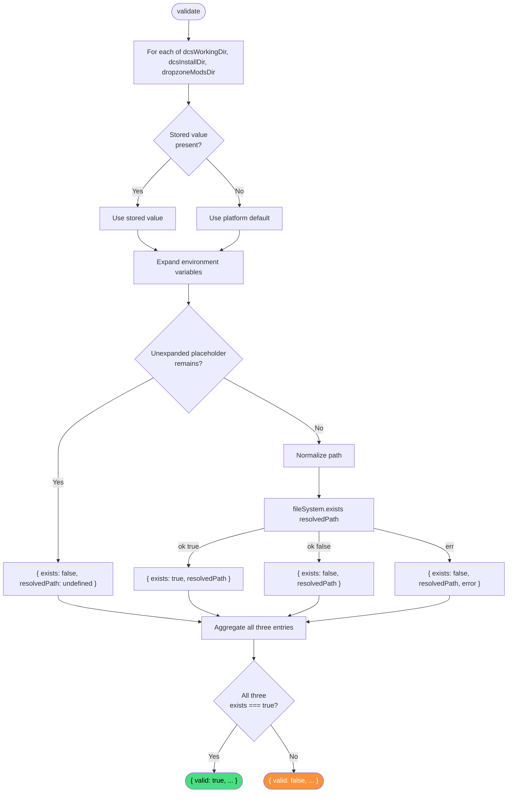

# Validate settings

**Stable**

Validating settings resolves each configured path by expanding environment variables and applying platform defaults, then checks whether each resolved path exists on disk. The result is used by the UI to determine whether the [Daemon](#) is ready to install and activate mods.

| Property      | Value                                                  |
|---------------|--------------------------------------------------------|
| Applies to    | Daemon                                                 |
| Trigger       | Client requests a readiness check on path configuration |
| Preconditions | None                                                   |

## Inputs

There are no inputs. The operation reads from the Daemon's stored settings.

### Assertions

| Assertion | Status |
|-----------|--------|
| None — the operation always returns a result, even if all paths are unconfigured | |

### Outputs

`SettingsValidationResult`
:   An object with a top-level `valid` flag and a `SettingsValidationEntry` for each of the three paths.

`valid`
:   `true` only when all three paths resolve successfully and exist on disk. `false` otherwise.

`SettingsValidationEntry` (per field)
:   One of three forms:

    - `{ exists: true, resolvedPath: string }` — path resolved and confirmed present on disk.
    - `{ exists: false, resolvedPath: string }` — path resolved but not found on disk.
    - `{ exists: false, resolvedPath: undefined }` — path could not be resolved (no stored value and the platform default contains an unexpanded environment variable).
    - `{ exists: false, resolvedPath: string, error: string }` — path resolved but the filesystem check itself failed.

### Effects

None. This is a read-only operation.

## Path resolution

Each path is resolved using the following steps:

1. Use the stored value if present; otherwise fall back to the platform default.
2. Expand environment variables (`%VAR%` on Windows; `$VAR` and `${VAR}` on POSIX).
3. If any placeholder remains unexpanded after step 2, treat the path as unresolvable (`undefined`).
4. Normalize the path.
5. Check whether the resolved path exists on disk.

**Platform defaults:**

| Field | Windows default | POSIX default |
|---|---|---|
| `dcsWorkingDir` | `%USERPROFILE%\Saved Games\DCS` | `$HOME/Saved Games/DCS` |
| `dcsInstallDir` | `%PROGRAMFILES%\Eagle Dynamics\DCS World` | `$HOME/Eagle Dynamics/DCS World` |
| `dropzoneModsDir` | `%LOCALAPPDATA%\DCS Dropzone\Mods` | `$HOME/.local/share/DCS Dropzone/Mods` |

> **Note:** If the environment variable referenced by a platform default is not defined on the host system, the path is unresolvable and `resolvedPath` is `undefined`. This can occur on non-standard Windows configurations where `%USERPROFILE%` or `%LOCALAPPDATA%` are not set.

## Behavior

## See Also

- [Get settings](/daemon/spec/get-settings) — Spec page for reading raw stored values without resolution.
- [Update settings](/daemon/spec/update-settings) — Spec page for writing path configuration.
- [Add Release](/daemon/spec/add-release) — Spec page for an operation that requires `dropzoneModsDir` to be valid.
- [Enable Release](/daemon/spec/enable-release) — Spec page for an operation that requires `dcsWorkingDir` and `dcsInstallDir` to be valid.
