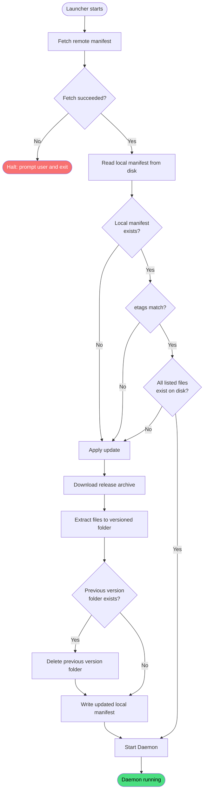

# Check for updates

**Stable**

Checking for updates is the first thing the [Launcher](#) does on every launch. It fetches the latest release [manifest](#) from the remote server, compares it against the locally installed manifest, applies an update if one is needed, and then starts the [Daemon](#).

| Property      | Value                                                        |
|---------------|--------------------------------------------------------------|
| Applies to    | Launcher                                                     |
| Trigger       | The user starts the Launcher                                 |
| Preconditions | The Launcher is configured with a remote manifest URL and a remote archive URL |

## Inputs

There are no caller-provided inputs. The Launcher reads all necessary configuration from its environment at startup.

### Assertions

| Assertion | Status |
|-----------|--------|
| The remote manifest URL must be reachable | <Badge type="tip" text="Implemented" /> |

### Outputs

This behavior does not return a value. On failure to fetch the remote manifest, the Launcher prints an error and halts, prompting the user to press Enter before exiting.

### Effects

| Effect | Status |
|--------|--------|
| The remote manifest is fetched from the configured URL | <Badge type="tip" text="Implemented" /> |
| If no local manifest exists, the update is applied as a fresh install | <Badge type="tip" text="Implemented" /> |
| If the remote manifest's `etag` differs from the local manifest's `etag`, the update is applied | <Badge type="tip" text="Implemented" /> |
| If any file listed in the local manifest is missing from disk, the update is applied | <Badge type="tip" text="Implemented" /> |
| If an update is applied, the release archive is downloaded and extracted into a versioned folder | <Badge type="tip" text="Implemented" /> |
| If an update is applied and a previous version folder exists, it is deleted after extraction completes | <Badge type="tip" text="Implemented" /> |
| If an update is applied, the local manifest is overwritten with the remote manifest | <Badge type="tip" text="Implemented" /> |
| The Daemon executable is spawned from the versioned release folder with `DZ_DAEMON_DATABASE_PATH` set | <Badge type="tip" text="Implemented" /> |

## Behavior

## See Also

- [How the Launcher works](/guides/how-the-launcher-works) — Guide covering the full update sequence and manifest comparison in depth.
- [How the Daemon works](/guides/how-the-daemon-works) — What the Daemon does after the Launcher starts it.
