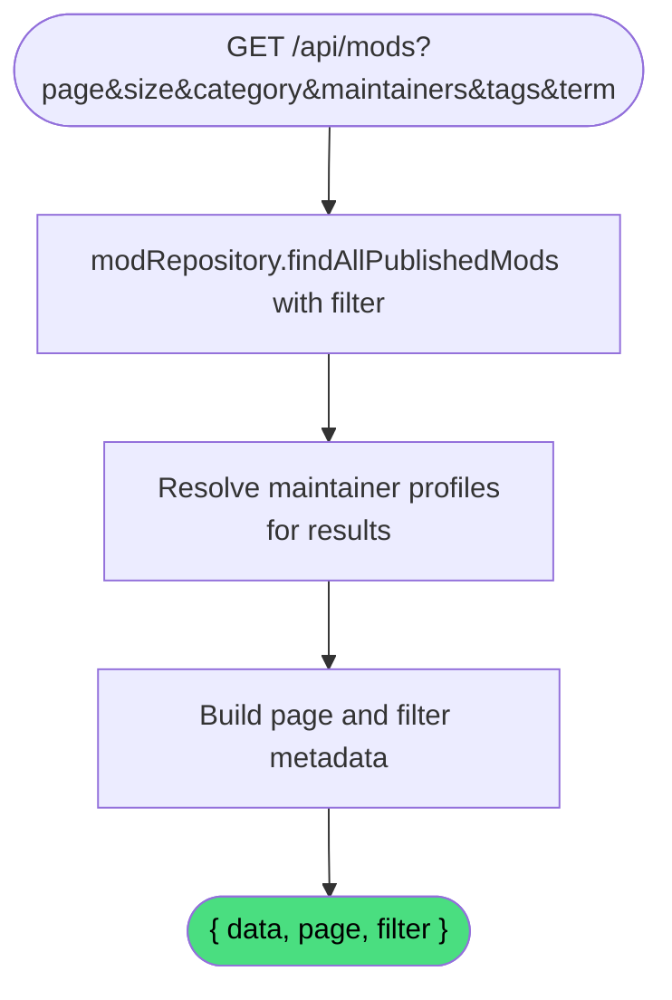

# Browse Mods

**Stable**

Browsing mods returns a paginated list of publicly visible [mods](#) from the [registry](#), optionally filtered by category, tags, maintainer, or a search term. The response includes the page metadata and the set of filter values available for the current result.

| Property      | Value                                                       |
|---------------|-------------------------------------------------------------|
| Applies to    | Webapp                                                      |
| Trigger       | Client requests `GET /api/mods` with optional filter params |
| Preconditions | None                                                        |

## Inputs

`page`
:   **Number, required.** The page number to return, zero-indexed.

`size`
:   **Number, required.** The number of results per page.

`category`
:   **Enum, optional.** Filters results to mods in the given category. One of `CAMPAIGN`, `DEVICE_PROFILES`, `MOD`, `MISSION`, `SKIN`, `SOUND`, `TERRAIN`, `UTILITY`, or `OTHER`.

`maintainers`
:   **Comma-separated string, optional.** Filters results to mods maintained by the given user identifiers.

`tags`
:   **Comma-separated string, optional.** Filters results to mods carrying all of the given tags.

`term`
:   **String, optional.** Free-text search term matched against mod names and descriptions.

### Assertions

| Assertion | Status |
|-----------|--------|
| None — all filter parameters are optional; omitting all returns all public mods | |

### Outputs

`{ data: ModSummaryData[], page: PageData, filter: ModAvailableFilterData }`
:   On success:

`data`
:   The list of mod summaries for the current page.

`page`
:   Pagination metadata: `number`, `size`, `totalPages`, and `totalElements`.

`filter`
:   The available filter values for the current result set: `categories`, `maintainers`, and `tags`.

### Effects

None. This is a read-only operation.

## Behavior

## See Also

- [Get mod](/webapp/spec/get-mod) — Spec page for fetching the full details of a single mod.
- [Get categories](/webapp/spec/get-categories) — Spec page for retrieving available category counts to populate the filter UI.
- [Get tags](/webapp/spec/get-tags) — Spec page for retrieving all available tag values.
