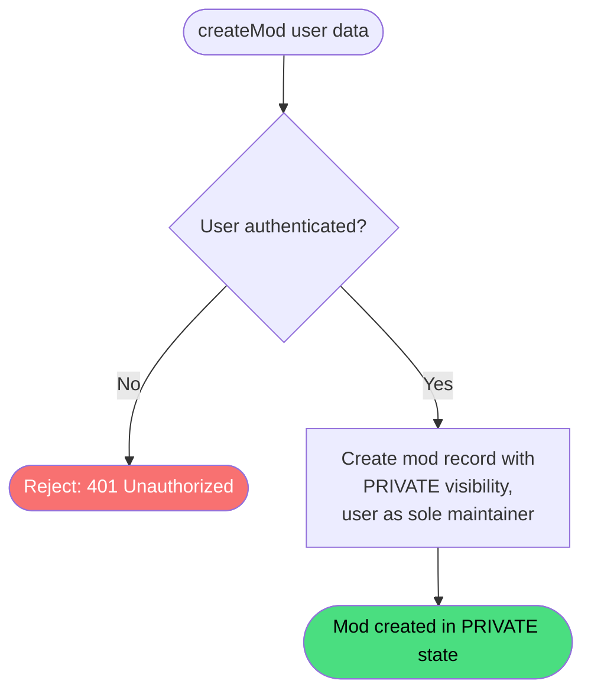

# Create Mod

**Stable**

Creating a [mod](#) registers a new entry in the [registry](#) under the authenticated maintainer's account. The mod is created as `PRIVATE` and contains no releases; the maintainer configures it and publishes it when ready.

| Property      | Value                                                        |
|---------------|--------------------------------------------------------------|
| Applies to    | Webapp                                                       |
| Trigger       | An authenticated user submits the create mod form            |
| Preconditions | The user is authenticated                                    |

## Inputs

`name`
:   **String, required.** The display name of the mod.

`category`
:   **Enum, required.** The category the mod belongs to. One of `CAMPAIGN`, `DEVICE_PROFILES`, `MOD`, `MISSION`, `SKIN`, `SOUND`, `TERRAIN`, `UTILITY`, or `OTHER`.

`description`
:   **String, required.** A short description of the mod shown in the catalogue.

### Assertions

| Assertion | Status |
|-----------|--------|
| The user must be authenticated | <Badge type="tip" text="Implemented" /> |

### Outputs

`ModData`
:   The created mod record. The operation always succeeds for authenticated users.

### Effects

| Effect | Status |
|--------|--------|
| A new mod record is created in the registry | <Badge type="tip" text="Implemented" /> |
| The mod's initial visibility is set to `PRIVATE` | <Badge type="tip" text="Implemented" /> |
| The authenticated user is set as the sole maintainer | <Badge type="tip" text="Implemented" /> |
| A unique identifier is generated and assigned to the mod | <Badge type="tip" text="Implemented" /> |

## Behavior

## See Also

- [Update mod](/webapp/spec/update-mod) — Spec page for editing a mod's details and changing its visibility.
- [Delete mod](/webapp/spec/delete-mod) — Spec page for removing a mod from the registry.
- [Create release](/webapp/spec/create-release) — Spec page for adding a release to a mod.
- [How the Webapp works](/guides/how-the-webapp-works) — Guide covering mod structure, visibility, and the maintainer model.
