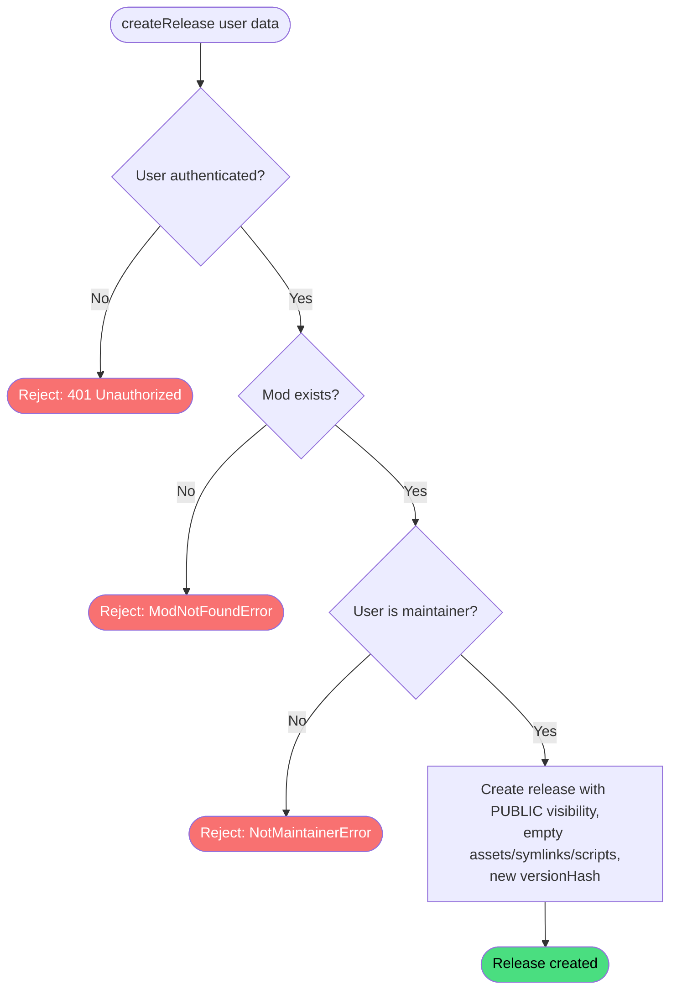

# Create release

**Stable**

Creating a [release](#) adds a new versioned snapshot to an existing [mod](#) in the [registry](#). The release is created empty — with no assets, symbolic links, or mission scripts — and the maintainer populates it by updating it before publishing.

| Property      | Value                                                        |
|---------------|--------------------------------------------------------------|
| Applies to    | Webapp                                                       |
| Trigger       | An authenticated maintainer submits the create release form  |
| Preconditions | The user is authenticated and is a maintainer of the mod     |

## Inputs

`modId`
:   **String, required.** The identifier of the mod to create a release for.

`version`
:   **String, required.** The version string for the release (e.g. `1.0.0`).

### Assertions

| Assertion | Status |
|-----------|--------|
| The user must be authenticated | <Badge type="tip" text="Implemented" /> |
| The mod must exist in the registry | <Badge type="tip" text="Implemented" /> |
| The authenticated user must be a maintainer of the mod | <Badge type="tip" text="Implemented" /> |

### Outputs

`Result<ModReleaseData, ModNotFoundError | NotMaintainerError>`
:   On success, returns the created release record. On failure, returns one of the following error types:

`ModNotFoundError`
:   The mod does not exist in the registry.

`NotMaintainerError`
:   The authenticated user is not a maintainer of the mod.

### Effects

| Effect | Status |
|--------|--------|
| A new release record is created in the registry | <Badge type="tip" text="Implemented" /> |
| The release's initial visibility is set to `PUBLIC` | <Badge type="tip" text="Implemented" /> |
| The release is created with empty `assets`, `symbolicLinks`, and `missionScripts` lists | <Badge type="tip" text="Implemented" /> |
| A unique identifier is generated and assigned to the release | <Badge type="tip" text="Implemented" /> |
| A `versionHash` is generated and stored with the release | <Badge type="tip" text="Implemented" /> |

## Behavior

## See Also

- [Update release](/webapp/spec/update-release) — Spec page for adding assets, symbolic links, and mission scripts to a release.
- [Delete release](/webapp/spec/delete-release) — Spec page for removing a release from the registry.
- [Create mod](/webapp/spec/create-mod) — Spec page for registering the mod that a release belongs to.
- [How the Webapp works](/guides/how-the-webapp-works) — Guide covering release structure, assets, and symbolic link definitions.
- [Add Release](/daemon/spec/add-release) — Spec page for the Daemon behavior that installs a release after the user requests it.
