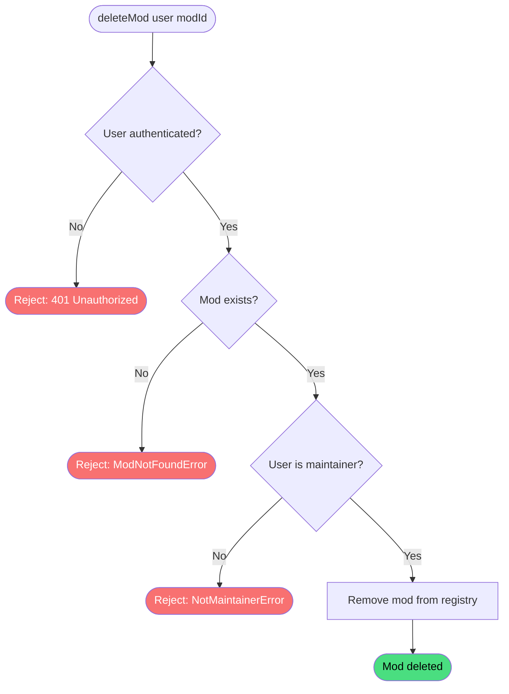

# Delete Mod

**Stable**

Deleting a [mod](#) permanently removes it from the [registry](#). Only a maintainer of the mod may delete it.

| Property      | Value                                                        |
|---------------|--------------------------------------------------------------|
| Applies to    | Webapp                                                       |
| Trigger       | An authenticated maintainer requests deletion of a mod       |
| Preconditions | The user is authenticated and is a maintainer of the mod     |

## Inputs

`modId`
:   **String, required.** The identifier of the mod to delete.

### Assertions

| Assertion | Status |
|-----------|--------|
| The user must be authenticated | <Badge type="tip" text="Implemented" /> |
| The mod must exist in the registry | <Badge type="tip" text="Implemented" /> |
| The authenticated user must be a maintainer of the mod | <Badge type="tip" text="Implemented" /> |

### Outputs

`Result<ModData, ModNotFoundError | NotMaintainerError>`
:   On success, returns the deleted mod record. On failure, returns one of the following error types:

`ModNotFoundError`
:   The mod does not exist in the registry.

`NotMaintainerError`
:   The authenticated user is not a maintainer of the mod.

### Effects

| Effect | Status |
|--------|--------|
| The mod record is permanently removed from the registry | <Badge type="tip" text="Implemented" /> |

## Behavior

## See Also

- [Create mod](/webapp/spec/create-mod) — Spec page for registering a new mod in the registry.
- [Update mod](/webapp/spec/update-mod) — Spec page for editing a mod's details.
- [Delete release](/webapp/spec/delete-release) — Spec page for removing a single release from a mod.
- [How the Webapp works](/guides/how-the-webapp-works) — Guide covering mod structure and the maintainer model.
