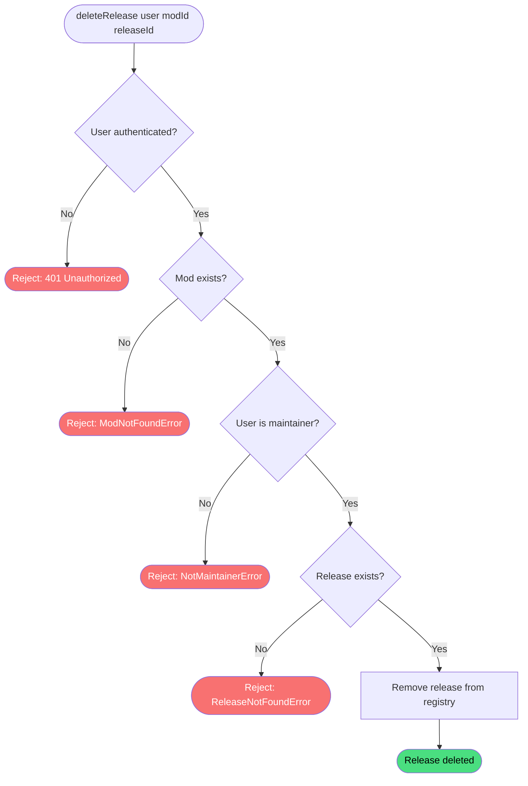

# Delete release

**Stable**

Deleting a [release](#) permanently removes it from the [registry](#). Only a maintainer of the parent [mod](#) may delete one of its releases.

| Property      | Value                                                        |
|---------------|--------------------------------------------------------------|
| Applies to    | Webapp                                                       |
| Trigger       | An authenticated maintainer requests deletion of a release   |
| Preconditions | The user is authenticated and is a maintainer of the mod     |

## Inputs

`modId`
:   **String, required.** The identifier of the mod the release belongs to.

`releaseId`
:   **String, required.** The identifier of the release to delete.

### Assertions

| Assertion | Status |
|-----------|--------|
| The user must be authenticated | <Badge type="tip" text="Implemented" /> |
| The mod must exist in the registry | <Badge type="tip" text="Implemented" /> |
| The authenticated user must be a maintainer of the mod | <Badge type="tip" text="Implemented" /> |
| The release must exist in the registry | <Badge type="tip" text="Implemented" /> |

### Outputs

`Result<ModReleaseData, ModNotFoundError | ReleaseNotFoundError | NotMaintainerError>`
:   On success, returns the deleted release record. On failure, returns one of the following error types:

`ModNotFoundError`
:   The mod does not exist in the registry.

`NotMaintainerError`
:   The authenticated user is not a maintainer of the mod.

`ReleaseNotFoundError`
:   The release does not exist in the registry.

### Effects

| Effect | Status |
|--------|--------|
| The release record is permanently removed from the registry | <Badge type="tip" text="Implemented" /> |

## Behavior

## See Also

- [Create release](/webapp/spec/create-release) — Spec page for adding a release to a mod.
- [Update release](/webapp/spec/update-release) — Spec page for editing a release's assets and configuration.
- [Delete mod](/webapp/spec/delete-mod) — Spec page for removing the parent mod from the registry.
- [How the Webapp works](/guides/how-the-webapp-works) — Guide covering release structure and the maintainer model.
