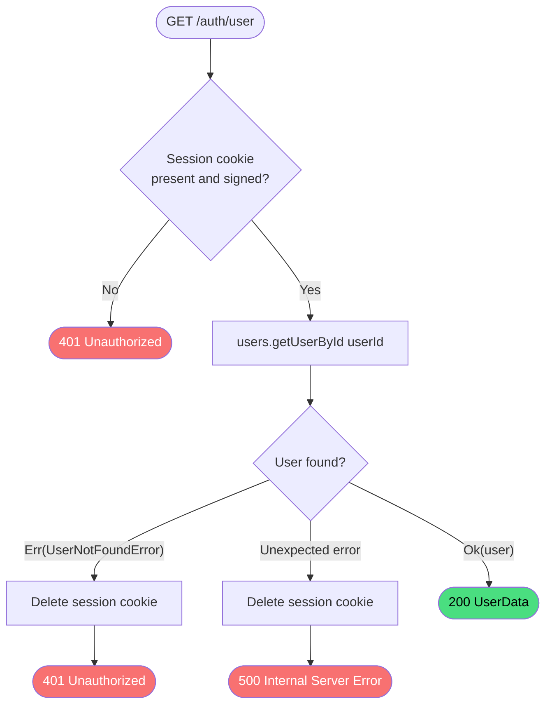

# Get Authenticated User

**Stable**

Getting the authenticated user returns the profile of the user identified by the session cookie. This endpoint is used by the UI to determine whether a session is active and to display the current user's identity.

| Property      | Value                                                     |
|---------------|-----------------------------------------------------------|
| Applies to    | Webapp                                                    |
| Trigger       | Client calls `GET /auth/user`                             |
| Preconditions | None — authentication is enforced by the request handler  |

## Inputs

Session cookie (implicit)
:   A signed cookie set during the [login](#) flow. The cookie name and signing secret are read from the Webapp's configuration. No explicit input is provided by the caller.

### Assertions

| Assertion | Status |
|-----------|--------|
| The session cookie must be present and correctly signed | <Badge type="tip" text="Implemented" /> |
| The user identified by the cookie must exist in the user store | <Badge type="tip" text="Implemented" /> |

### Outputs

`UserData`
:   The authenticated user's profile, including `id`, `username`, `name`, `avatarUrl`, and `profileUrl`. Returned with `200 OK`.

`401 Unauthorized`
:   Returned when the cookie is absent, unsigned, or identifies a user that no longer exists in the store. The session cookie is deleted when the user is not found.

`500 Internal Server Error`
:   Returned when an unexpected error occurs during user lookup. The session cookie is deleted.

### Effects

| Effect | Status |
|--------|--------|
| If the cookie references a user not found in the store, the session cookie is deleted from the client | <Badge type="tip" text="Implemented" /> |
| If an unexpected error occurs during user lookup, the session cookie is deleted from the client | <Badge type="tip" text="Implemented" /> |

## Behavior

## See Also

- [Login](/webapp/spec/login) — Spec page for the flow that sets the session cookie this endpoint reads.
- [Logout](/webapp/spec/logout) — Spec page for the flow that clears the session cookie.
- [How the Webapp works](/guides/how-the-webapp-works) — Guide covering authentication and the maintainer model.
