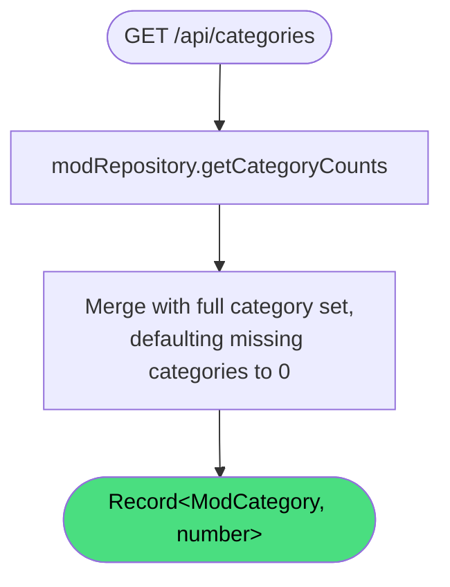

# Get categories

**Stable**

Getting categories returns every [mod](#) category along with the count of publicly visible mods in each. All categories are always present in the response, even those with no published mods.

| Property      | Value                                              |
|---------------|----------------------------------------------------|
| Applies to    | Webapp                                             |
| Trigger       | Client requests `GET /api/categories`              |
| Preconditions | None                                               |

## Inputs

There are no inputs.

### Assertions

| Assertion | Status |
|-----------|--------|
| None — the operation always succeeds | |

### Outputs

`Record<ModCategory, number>`
:   A map of every category name to the count of published mods in that category. Categories with no mods have a count of `0`. The set of keys is always the full set of defined categories: `CAMPAIGN`, `DEVICE_PROFILES`, `MOD`, `MISSION`, `SKIN`, `SOUND`, `TERRAIN`, `UTILITY`, and `OTHER`.

### Effects

None. This is a read-only operation.

> **Note:** The response always includes all categories. Callers can rely on every category key being present without checking for undefined.

## Behavior

## See Also

- [Browse mods](/webapp/spec/browse-mods) — Spec page for filtering mods by category.
- [Get tags](/webapp/spec/get-tags) — Spec page for retrieving all available tags.
