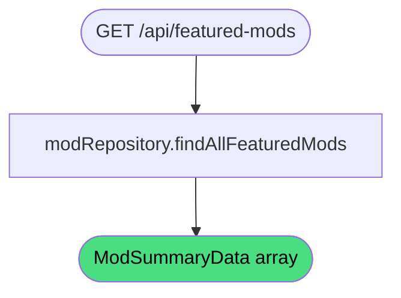

# Get Featured Mods

**Stable**

Getting featured mods returns the set of [mods](#) selected for display on the [Webapp's](#) homepage. Featured mods are chosen by the registry and do not change based on user input.

| Property      | Value                                              |
|---------------|----------------------------------------------------|
| Applies to    | Webapp                                             |
| Trigger       | Client requests `GET /api/featured-mods`           |
| Preconditions | None                                               |

## Inputs

There are no inputs.

### Assertions

| Assertion | Status |
|-----------|--------|
| None — the operation always succeeds | |

### Outputs

`ModSummaryData[]`
:   A list of mod summaries for the featured mods. May be empty if no mods are currently featured.

### Effects

None. This is a read-only operation.

## Behavior

## See Also

- [Get popular mods](/webapp/spec/get-popular-mods) — Spec page for retrieving mods sorted by download count.
- [Get server metrics](/webapp/spec/get-server-metrics) — Spec page for aggregate registry statistics.
- [Browse mods](/webapp/spec/browse-mods) — Spec page for paginated, filtered mod discovery.
