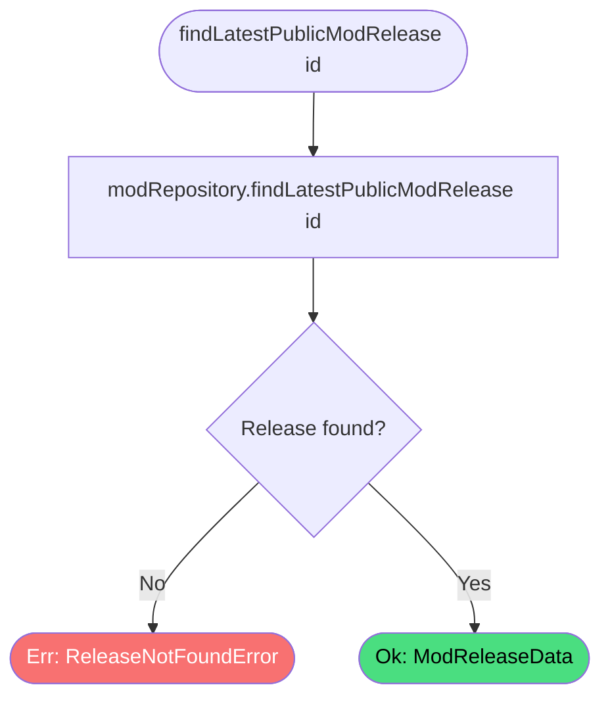

# Get Latest Mod Release

**Stable**

Getting the latest mod release returns the most recently created public [release](#) for a [mod](#). The [Daemon](#) calls this endpoint when a user requests installation of a mod to obtain the assets, symbolic link definitions, and mission scripts needed to install it.

| Property      | Value                                                             |
|---------------|-------------------------------------------------------------------|
| Applies to    | Webapp                                                            |
| Trigger       | Daemon requests the latest release for a mod prior to installation |
| Preconditions | None                                                              |

## Inputs

`id`
:   **String, required (path parameter).** The identifier of the mod.

### Assertions

| Assertion | Status |
|-----------|--------|
| None — the operation proceeds for any mod identifier | |

### Outputs

`Result<ModReleaseData, ReleaseNotFoundError>`
:   On success, returns the full release record including assets, symbolic link definitions, and mission scripts. On failure, returns:

`ReleaseNotFoundError`
:   The mod does not exist, or the mod has no public releases. Both cases return the same error — there is no separate `ModNotFoundError` path.

### Effects

None. This is a read-only operation.

## Behavior

## See Also

- [Register mod release download](/webapp/spec/register-mod-release-download) — Spec page for the call the Daemon makes after a successful installation.
- [Add Release](/daemon/spec/add-release) — Spec page for the Daemon behavior that consumes the release data returned here.
- [Update release](/webapp/spec/update-release) — Spec page for how maintainers populate the assets and symlink definitions returned by this endpoint.
- [How the Webapp works](/guides/how-the-webapp-works) — Guide covering release structure and how the Daemon uses it.
