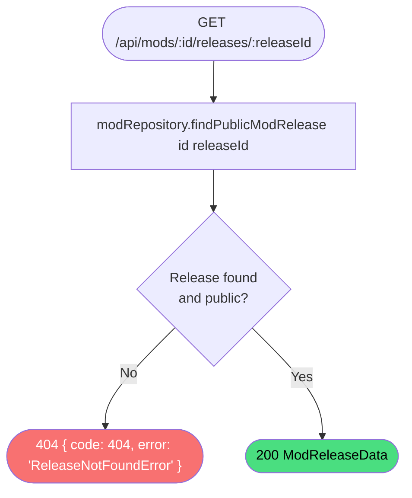

# Get mod release

**Stable**

Getting a mod release returns the full details of a single publicly visible [release](#) for a [mod](#), including its assets, symbolic link definitions, and mission scripts.

| Property      | Value                                                       |
|---------------|-------------------------------------------------------------|
| Applies to    | Webapp                                                      |
| Trigger       | Client requests `GET /api/mods/:id/releases/:releaseId`     |
| Preconditions | None                                                        |

## Inputs

`id`
:   **String, required (path parameter).** The identifier of the mod.

`releaseId`
:   **String, required (path parameter).** The identifier of the release.

### Assertions

| Assertion | Status |
|-----------|--------|
| The release must exist and be publicly visible | <Badge type="tip" text="Implemented" /> |

### Outputs

`ModReleaseData`
:   Returned with `200 OK` when the release is found.

`{ code: 404, error: "ReleaseNotFoundError" }`
:   Returned when the release does not exist, is not publicly visible, or the parent mod is not publicly visible.

### Effects

None. This is a read-only operation.

## Behavior

## See Also

- [Get mod releases](/webapp/spec/get-mod-releases) — Spec page for listing all releases for a mod.
- [Get latest mod release](/webapp/spec/get-latest-mod-release) — Spec page for fetching the most recent release.
- [Register mod release download](/webapp/spec/register-mod-release-download) — Spec page for the download registration call made after installation.
