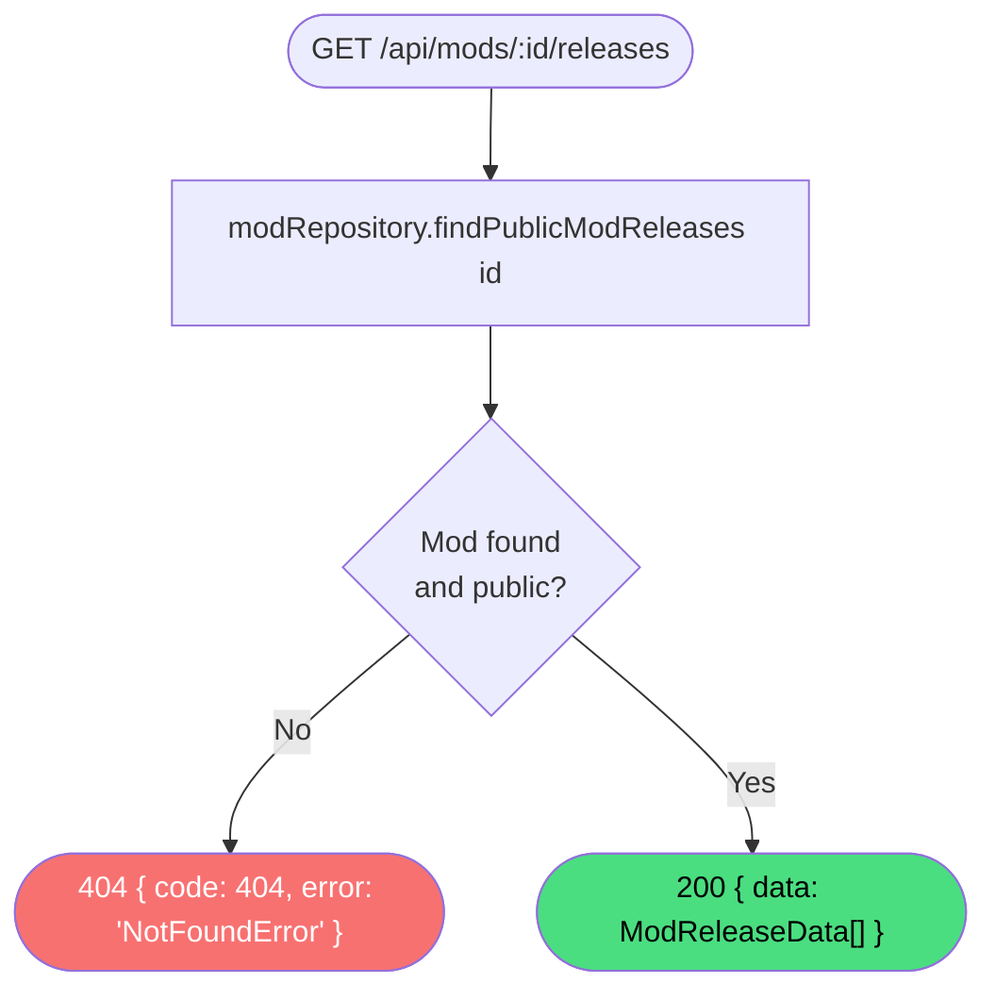

# Get mod releases

**Stable**

Getting mod releases returns all publicly visible [releases](#) for a specific [mod](#). The [Daemon](#) uses this list to display available versions when a user manages an installed mod.

| Property      | Value                                                    |
|---------------|----------------------------------------------------------|
| Applies to    | Webapp                                                   |
| Trigger       | Client requests `GET /api/mods/:id/releases`             |
| Preconditions | None                                                     |

## Inputs

`id`
:   **String, required (path parameter).** The identifier of the mod.

### Assertions

| Assertion | Status |
|-----------|--------|
| The mod must exist and be publicly visible | <Badge type="tip" text="Implemented" /> |

### Outputs

`{ data: ModReleaseData[] }`
:   Returned with `200 OK` when the mod is found. The list contains all public releases for the mod, which may be empty if none have been published.

`{ code: 404, error: "NotFoundError" }`
:   Returned when the mod does not exist or is not publicly visible.

### Effects

None. This is a read-only operation.

## Behavior

## See Also

- [Get mod release](/webapp/spec/get-mod-release) — Spec page for fetching a single release by identifier.
- [Get latest mod release](/webapp/spec/get-latest-mod-release) — Spec page for fetching the most recent release, used by the Daemon when installing.
- [Get mod](/webapp/spec/get-mod) — Spec page for the parent mod record.
