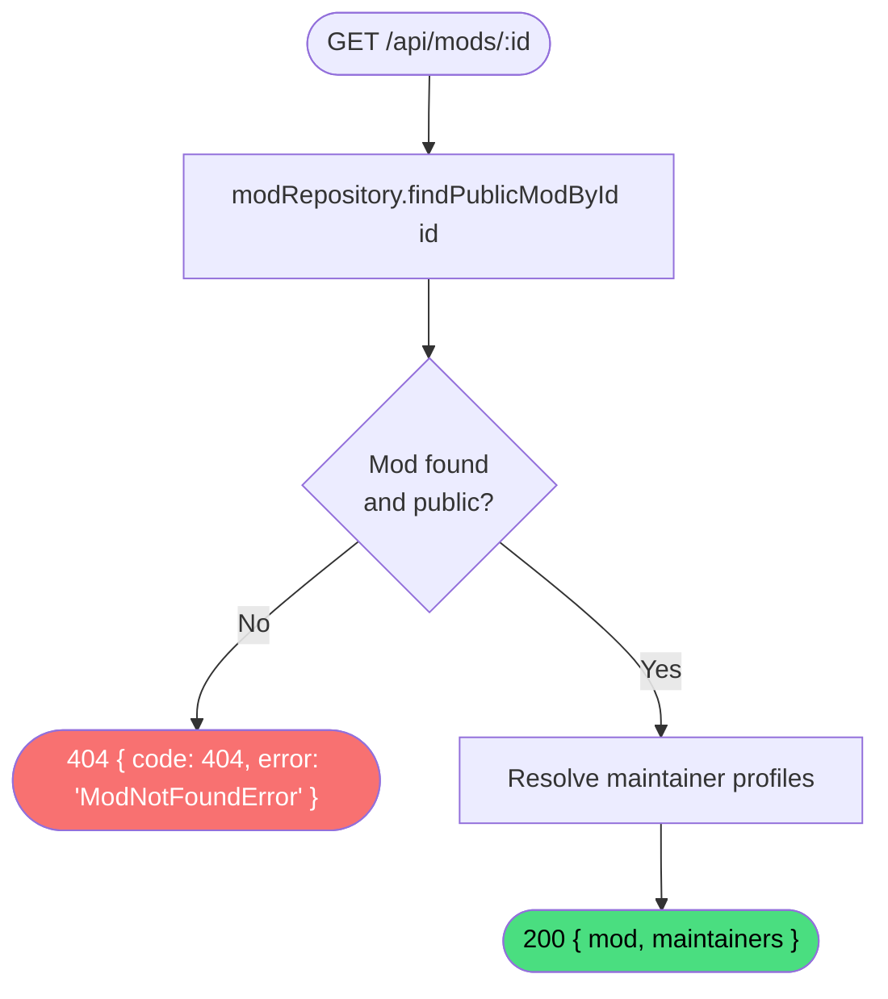

# Get mod

**Stable**

Getting a mod returns the full details of a single publicly visible [mod](#) from the [registry](#), along with the resolved profiles of its maintainers.

| Property      | Value                                              |
|---------------|----------------------------------------------------|
| Applies to    | Webapp                                             |
| Trigger       | Client requests `GET /api/mods/:id`                |
| Preconditions | None                                               |

## Inputs

`id`
:   **String, required (path parameter).** The identifier of the mod.

### Assertions

| Assertion | Status |
|-----------|--------|
| The mod must exist and be publicly visible | <Badge type="tip" text="Implemented" /> |

### Outputs

`{ mod: ModData, maintainers: UserData[] }`
:   Returned with `200 OK` when the mod is found. Includes the full mod record and the resolved profile for each maintainer.

`{ code: 404, error: "ModNotFoundError" }`
:   Returned when the mod does not exist or is not publicly visible.

### Effects

None. This is a read-only operation.

## Behavior

## See Also

- [Browse mods](/webapp/spec/browse-mods) — Spec page for the paginated list that links to individual mod pages.
- [Get mod releases](/webapp/spec/get-mod-releases) — Spec page for listing the releases for this mod.
