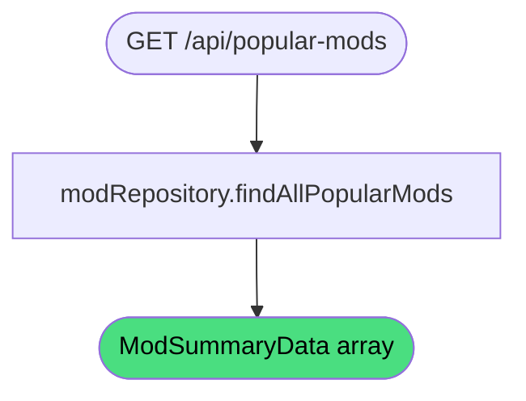

# Get popular mods

**Stable**

Getting popular mods returns a set of [mods](#) ranked by download count. The list is used to surface trending or widely-used content on the [Webapp's](#) homepage.

| Property      | Value                                              |
|---------------|----------------------------------------------------|
| Applies to    | Webapp                                             |
| Trigger       | Client requests `GET /api/popular-mods`            |
| Preconditions | None                                               |

## Inputs

There are no inputs.

### Assertions

| Assertion | Status |
|-----------|--------|
| None — the operation always succeeds | |

### Outputs

`ModSummaryData[]`
:   A list of mod summaries ordered by popularity. May be empty if no mods have been downloaded.

### Effects

None. This is a read-only operation.

## Behavior

## See Also

- [Get featured mods](/webapp/spec/get-featured-mods) — Spec page for retrieving editorially selected mods.
- [Get server metrics](/webapp/spec/get-server-metrics) — Spec page for aggregate registry statistics.
- [Browse mods](/webapp/spec/browse-mods) — Spec page for paginated, filtered mod discovery.
