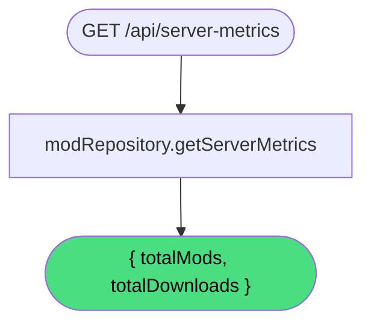

# Get server metrics

**Stable**

Getting server metrics returns aggregate statistics for the [registry](#) — the total number of published [mods](#) and the total number of mod downloads across all releases.

| Property      | Value                                                 |
|---------------|-------------------------------------------------------|
| Applies to    | Webapp                                                |
| Trigger       | Client requests `GET /api/server-metrics`             |
| Preconditions | None                                                  |

## Inputs

There are no inputs.

### Assertions

| Assertion | Status |
|-----------|--------|
| None — the operation always succeeds | |

### Outputs

`ServerMetricsData`
:   An object with two fields:

`totalMods`
:   **Number.** The total count of publicly visible mods in the registry.

`totalDownloads`
:   **Number.** The total count of recorded downloads across all releases.

### Effects

None. This is a read-only operation.

## Behavior

## See Also

- [Get featured mods](/webapp/spec/get-featured-mods) — Spec page for retrieving highlighted mods for the dashboard.
- [Get popular mods](/webapp/spec/get-popular-mods) — Spec page for retrieving mods sorted by download count.
