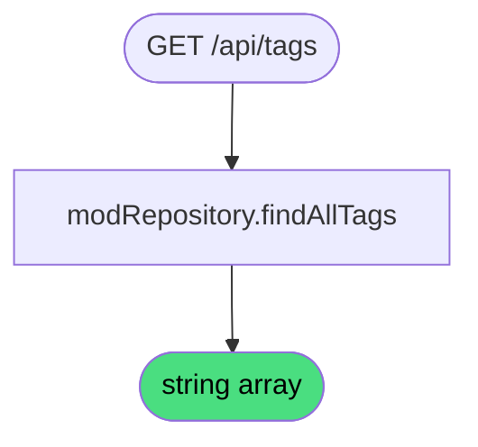

# Get Tags

**Stable**

Getting tags returns all tag strings currently in use across published [mods](#) in the [registry](#). The list is used to populate the tag filter in the mod browser.

| Property      | Value                                              |
|---------------|----------------------------------------------------|
| Applies to    | Webapp                                             |
| Trigger       | Client requests `GET /api/tags`                    |
| Preconditions | None                                               |

## Inputs

There are no inputs.

### Assertions

| Assertion | Status |
|-----------|--------|
| None — the operation always succeeds | |

### Outputs

`string[]`
:   A list of all distinct tag strings across published mods. May be empty if no mods have tags.

### Effects

None. This is a read-only operation.

## Behavior

## See Also

- [Browse mods](/webapp/spec/browse-mods) — Spec page for filtering mods by tag.
- [Get categories](/webapp/spec/get-categories) — Spec page for retrieving mod category counts.
