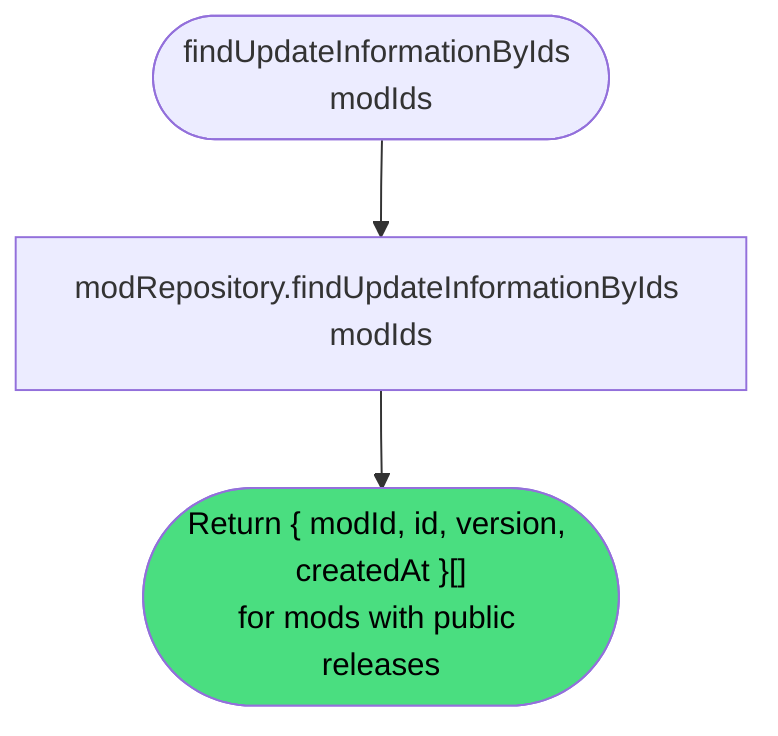

# Get Update Information

**Experimental**

Getting update information returns the latest release identifier, version, and creation timestamp for each of a given set of [mods](#). This is the mechanism by which the [Daemon](#) checks whether any installed mod has a newer release available in the [registry](#).

> **Note:** No HTTP endpoint currently exposes this behavior. It is implemented as an internal service method and consumed in tests. A public endpoint is anticipated when the Daemon update-check flow is implemented.

| Property      | Value                                                                     |
|---------------|---------------------------------------------------------------------------|
| Applies to    | Webapp                                                                    |
| Trigger       | Caller provides a list of mod identifiers to check for available updates  |
| Preconditions | None                                                                      |

## Inputs

`modIds`
:   **String array, required.** The identifiers of the mods to check.

### Assertions

| Assertion | Status |
|-----------|--------|
| None — unknown mod identifiers are silently omitted from the result | |

### Outputs

`{ modId: string; id: string; version: string; createdAt: string }[]`
:   One entry per mod that has at least one public release. Mods with no public releases, or identifiers that do not correspond to any known mod, are omitted from the result. The result may contain fewer entries than the input list.

### Effects

None. This is a read-only operation.

## Behavior

## See Also

- [Get latest mod release](/webapp/spec/get-latest-mod-release) — Spec page for fetching full release data once an update is detected.
- [Add Release](/daemon/spec/add-release) — Spec page for the Daemon behavior that installs a newer release.
- [How the Webapp works](/guides/how-the-webapp-works) — Guide covering release versioning and the `versionHash` field.
- [Update release](/webapp/spec/update-release) — Spec page for how maintainers publish a new version, which changes the `versionHash` that triggers update detection.
