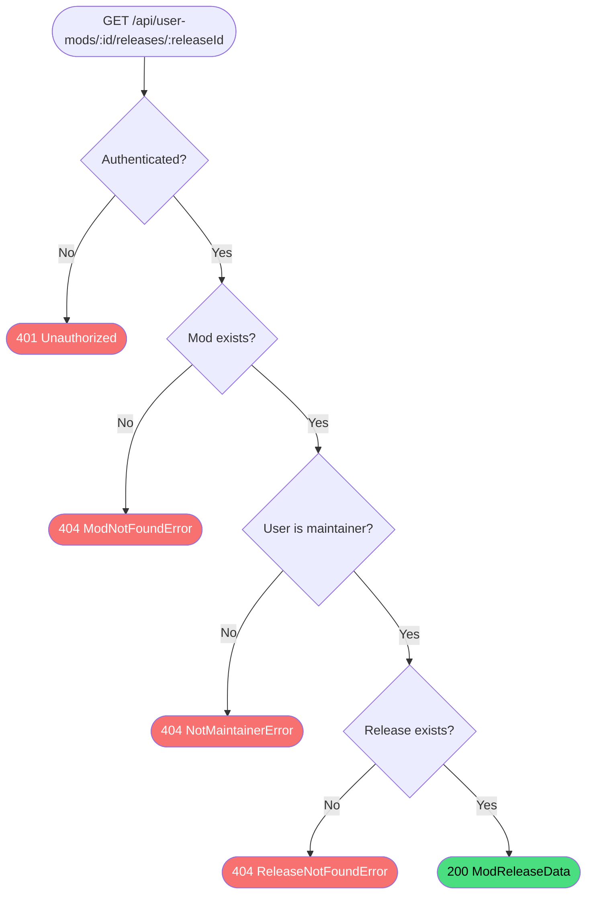

# Get User Mod Release

**Stable**

Getting a user mod release returns the full details of a single [release](#) for a [mod](#) owned by the authenticated user, including its assets, symbolic link definitions, and mission scripts. Only maintainers of the mod may retrieve it.

| Property      | Value                                                            |
|---------------|------------------------------------------------------------------|
| Applies to    | Webapp                                                           |
| Trigger       | Client requests `GET /api/user-mods/:id/releases/:releaseId`     |
| Preconditions | The user is authenticated and is a maintainer of the mod         |

## Inputs

`id`
:   **String, required (path parameter).** The identifier of the mod.

`releaseId`
:   **String, required (path parameter).** The identifier of the release.

### Assertions

| Assertion | Status |
|-----------|--------|
| The user must be authenticated | <Badge type="tip" text="Implemented" /> |
| The mod must exist | <Badge type="tip" text="Implemented" /> |
| The authenticated user must be a maintainer of the mod | <Badge type="tip" text="Implemented" /> |
| The release must exist | <Badge type="tip" text="Implemented" /> |

### Outputs

`ModReleaseData`
:   Returned with `200 OK` when the release is found and the user is a maintainer.

`{ code: 404, error: "ModNotFoundError" | "NotMaintainerError" | "ReleaseNotFoundError" }`
:   Returned when the mod does not exist, the user is not a maintainer, or the release does not exist.

`401 Unauthorized`
:   Returned when the session cookie is absent or invalid.

### Effects

None. This is a read-only operation.

## Behavior

## See Also

- [Get user mod releases](/webapp/spec/get-user-mod-releases) — Spec page for listing all releases for this mod.
- [Update release](/webapp/spec/update-release) — Spec page for editing this release's content.
- [Delete release](/webapp/spec/delete-release) — Spec page for removing this release.
