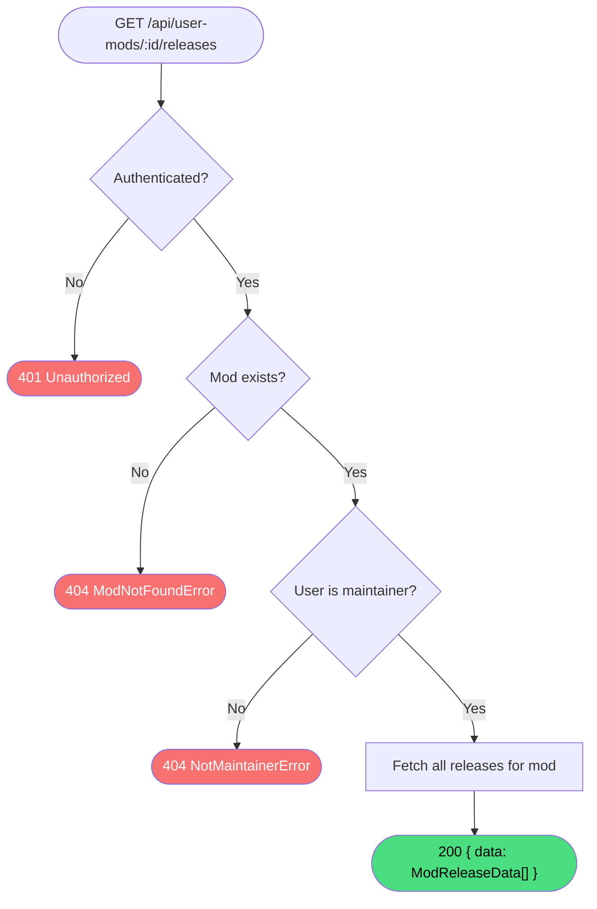

# Get User Mod Releases

**Stable**

Getting user mod releases returns all [releases](#) for a [mod](#) owned by the authenticated user. Only maintainers of the mod may retrieve this list.

| Property      | Value                                                      |
|---------------|------------------------------------------------------------|
| Applies to    | Webapp                                                     |
| Trigger       | Client requests `GET /api/user-mods/:id/releases`          |
| Preconditions | The user is authenticated and is a maintainer of the mod   |

## Inputs

`id`
:   **String, required (path parameter).** The identifier of the mod.

### Assertions

| Assertion | Status |
|-----------|--------|
| The user must be authenticated | <Badge type="tip" text="Implemented" /> |
| The mod must exist | <Badge type="tip" text="Implemented" /> |
| The authenticated user must be a maintainer of the mod | <Badge type="tip" text="Implemented" /> |

### Outputs

`{ data: ModReleaseData[] }`
:   Returned with `200 OK` when the mod is found and the user is a maintainer. The list includes all releases regardless of their visibility, and may be empty.

`{ code: 404, error: "ModNotFoundError" | "NotMaintainerError" }`
:   Returned when the mod does not exist or the user is not a maintainer.

`401 Unauthorized`
:   Returned when the session cookie is absent or invalid.

### Effects

None. This is a read-only operation.

## Behavior

## See Also

- [Get user mod release](/webapp/spec/get-user-mod-release) — Spec page for fetching a single release by identifier.
- [Create release](/webapp/spec/create-release) — Spec page for adding a new release to this mod.
- [Get user mod](/webapp/spec/get-user-mod) — Spec page for the parent mod record.
