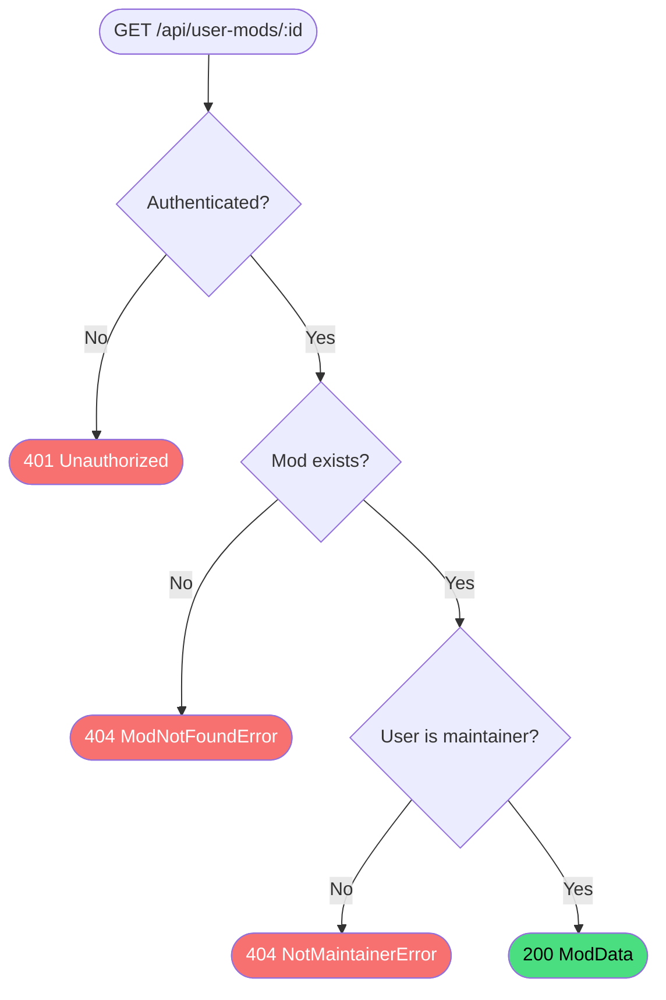

# Get user mod

**Stable**

Getting a user mod returns the full details of a single [mod](#) owned by the authenticated user. Only maintainers of the mod may retrieve it through this endpoint.

| Property      | Value                                                      |
|---------------|------------------------------------------------------------|
| Applies to    | Webapp                                                     |
| Trigger       | Client requests `GET /api/user-mods/:id`                   |
| Preconditions | The user is authenticated and is a maintainer of the mod   |

## Inputs

`id`
:   **String, required (path parameter).** The identifier of the mod.

### Assertions

| Assertion | Status |
|-----------|--------|
| The user must be authenticated | <Badge type="tip" text="Implemented" /> |
| The mod must exist | <Badge type="tip" text="Implemented" /> |
| The authenticated user must be a maintainer of the mod | <Badge type="tip" text="Implemented" /> |

### Outputs

`ModData`
:   Returned with `200 OK` when the mod is found and the user is a maintainer.

`{ code: 404, error: "ModNotFoundError" | "NotMaintainerError" }`
:   Returned when the mod does not exist or the user is not a maintainer. Both cases return `404` — the distinction between "not found" and "not authorised" is not exposed to the caller.

`401 Unauthorized`
:   Returned when the session cookie is absent or invalid.

### Effects

None. This is a read-only operation.

## Behavior

## See Also

- [Get user mods](/webapp/spec/get-user-mods) — Spec page for listing all mods owned by the authenticated user.
- [Update mod](/webapp/spec/update-mod) — Spec page for editing this mod's details.
- [Get user mod releases](/webapp/spec/get-user-mod-releases) — Spec page for listing this mod's releases.
