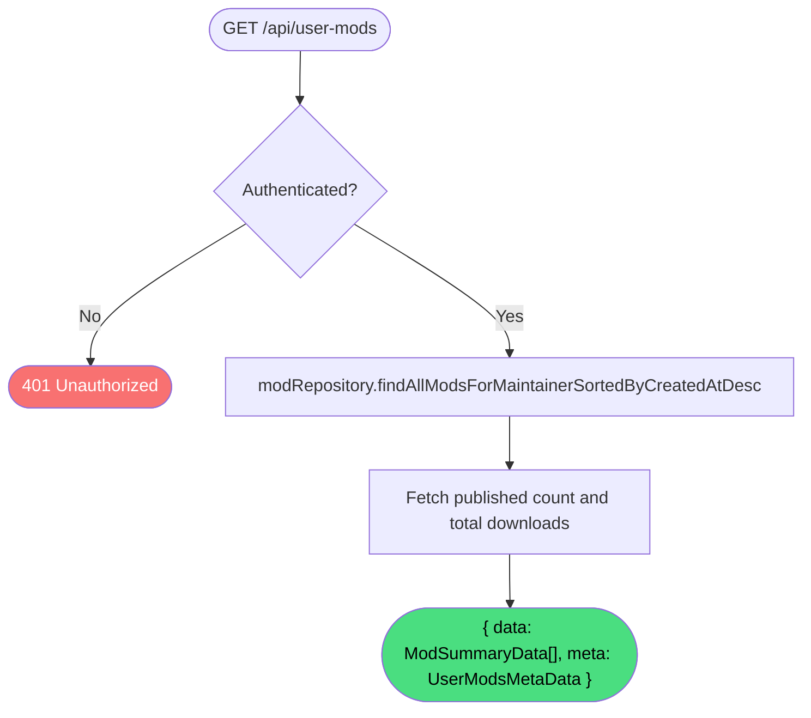

# Get user mods

**Stable**

Getting user mods returns all [mods](#) owned by the authenticated user, along with aggregate statistics about their published content and total downloads.

| Property      | Value                                                      |
|---------------|------------------------------------------------------------|
| Applies to    | Webapp                                                     |
| Trigger       | Client requests `GET /api/user-mods`                       |
| Preconditions | The user is authenticated                                  |

## Inputs

There are no caller-provided inputs. The authenticated user is resolved from the session cookie.

### Assertions

| Assertion | Status |
|-----------|--------|
| The user must be authenticated | <Badge type="tip" text="Implemented" /> |

### Outputs

`{ data: ModSummaryData[], meta: UserModsMetaData }`
:   On success:

`data`
:   All mods for which the authenticated user is a maintainer, sorted by creation date descending.

`meta`
:   Aggregate statistics: `published` (count of publicly visible mods) and `totalDownloads` (total download count across all maintained mods).

`401 Unauthorized`
:   Returned when the session cookie is absent or invalid.

### Effects

None. This is a read-only operation.

## Behavior

## See Also

- [Get user mod](/webapp/spec/get-user-mod) — Spec page for fetching a single user-owned mod.
- [Create mod](/webapp/spec/create-mod) — Spec page for adding a new mod to the user's collection.
