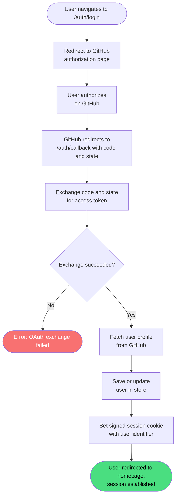

# Login

**Stable**

Logging in authenticates a user with the [Webapp](#) via the GitHub OAuth web flow. On completion, a signed session cookie is set in the user's browser and the user is redirected to the homepage.

| Property      | Value                                                         |
|---------------|---------------------------------------------------------------|
| Applies to    | Webapp                                                        |
| Trigger       | A user navigates to the login endpoint                        |
| Preconditions | The Webapp is configured with a valid GitHub OAuth application |

## Inputs

This behavior accepts no user-provided inputs at the start of the flow. GitHub returns a `code` and `state` to the callback endpoint as part of the OAuth protocol.

`code`
:   **String, required (callback).** The authorization code issued by GitHub and returned to the callback URL.

`state`
:   **String, required (callback).** The state parameter issued by the Webapp and echoed back by GitHub for validation.

### Assertions

| Assertion | Status |
|-----------|--------|
| The `code` and `state` parameters must be present on the callback request | <Badge type="tip" text="Implemented" /> |

### Outputs

On success, the user is redirected to the homepage with a session cookie set. There is no JSON response body.

### Effects

| Effect | Status |
|--------|--------|
| The user is redirected to the GitHub authorization page | <Badge type="tip" text="Implemented" /> |
| The authorization code is exchanged with GitHub for an access token | <Badge type="tip" text="Implemented" /> |
| The authenticated user's profile is fetched from GitHub | <Badge type="tip" text="Implemented" /> |
| The user's profile is saved or updated in the Webapp's user store | <Badge type="tip" text="Implemented" /> |
| A signed session cookie containing the user's identifier is set in the browser | <Badge type="tip" text="Implemented" /> |
| The user is redirected to the homepage | <Badge type="tip" text="Implemented" /> |

## Behavior

The login flow spans two HTTP requests. The first redirects the user to GitHub; the second handles the return from GitHub.

## See Also

- [Logout](/webapp/spec/logout) — Spec page for ending a session.
- [How the Webapp works](/guides/how-the-webapp-works) — Guide covering authentication and the maintainer model.
