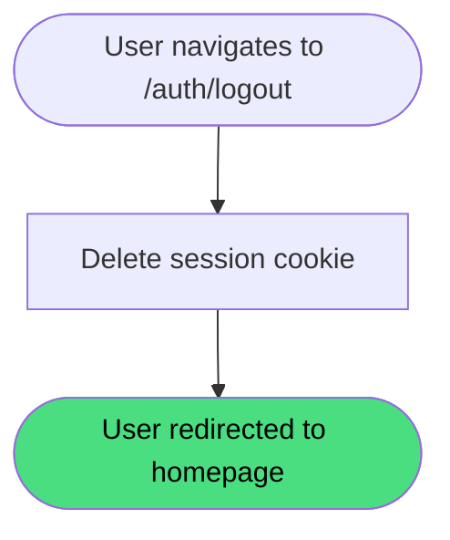

# Logout

**Stable**

Logging out ends the user's session by deleting the signed session cookie from the browser and redirecting to the homepage. The operation completes regardless of whether a valid session exists.

| Property      | Value                                                    |
|---------------|----------------------------------------------------------|
| Applies to    | Webapp                                                   |
| Trigger       | A user navigates to the logout endpoint                  |
| Preconditions | None                                                     |

## Inputs

There are no inputs. The session cookie is read from the request automatically.

### Assertions

| Assertion | Status |
|-----------|--------|
| None — logout proceeds whether or not a valid session cookie is present | |

### Outputs

The user is redirected to the homepage. There is no JSON response body.

### Effects

| Effect | Status |
|--------|--------|
| The session cookie is deleted from the browser | <Badge type="tip" text="Implemented" /> |
| The user is redirected to the homepage | <Badge type="tip" text="Implemented" /> |

## Behavior

## See Also

- [Login](/webapp/spec/login) — Spec page for establishing a session via the GitHub OAuth flow.
- [How the Webapp works](/guides/how-the-webapp-works) — Guide covering authentication and the maintainer model.
