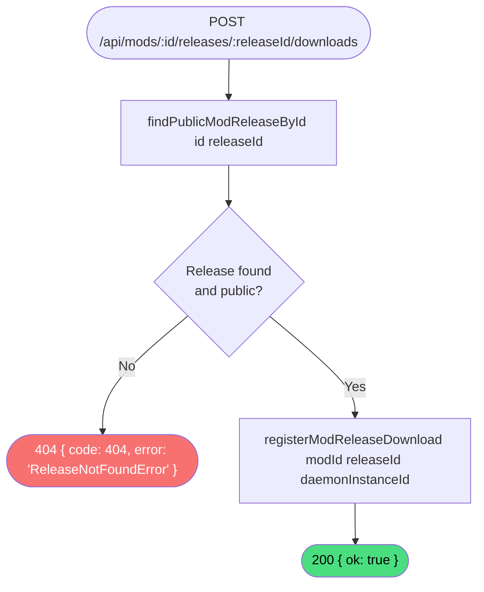

# Register mod release download

**Stable**

Registering a mod release download records that a [Daemon](#) instance has installed a specific [release](#). The [Daemon](#) calls this endpoint immediately after a successful installation to increment the release's download count.

| Property      | Value                                                                    |
|---------------|--------------------------------------------------------------------------|
| Applies to    | Webapp                                                                   |
| Trigger       | Daemon calls `POST /api/mods/:id/releases/:releaseId/downloads` after installing a release |
| Preconditions | None — no authentication required                                        |

## Inputs

`id`
:   **String, required (path parameter).** The identifier of the mod.

`releaseId`
:   **String, required (path parameter).** The identifier of the release.

`daemonInstanceId`
:   **String, required (request body).** The unique identifier of the Daemon instance that performed the installation.

### Assertions

| Assertion | Status |
|-----------|--------|
| The release must exist and be publicly visible in the registry | <Badge type="tip" text="Implemented" /> |

### Outputs

`{ ok: true }`
:   Returned when the release is found and the download is recorded.

`{ code: 404, error: "ReleaseNotFoundError" }`
:   Returned when the release does not exist or is not public. No download is recorded.

### Effects

| Effect | Status |
|--------|--------|
| A download record is written to the downloads store for the `(modId, releaseId, daemonInstanceId)` triple | <Badge type="tip" text="Implemented" /> |

## Behavior

## See Also

- [Get latest mod release](/webapp/spec/get-latest-mod-release) — Spec page for the endpoint the Daemon calls before installing a release.
- [Add Release](/daemon/spec/add-release) — Spec page for the Daemon behavior that triggers this call on completion.
- [How the Webapp works](/guides/how-the-webapp-works) — Guide covering the registry and how the Daemon interacts with it.
