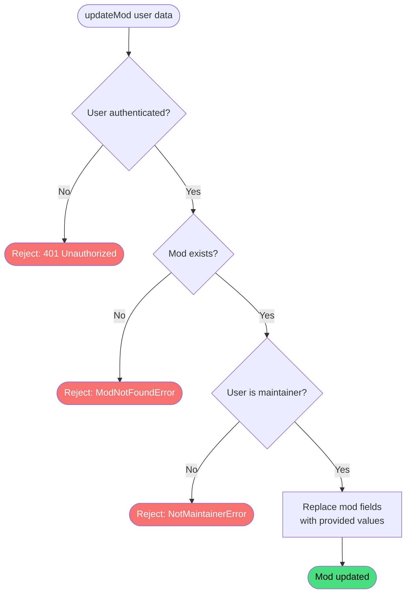

# Update mod

**Stable**

Updating a [mod](#) replaces the mod's stored fields with the values provided by the maintainer. This is the mechanism used to change a mod's name, description, tags, screenshots, maintainer list, and [visibility](#).

| Property      | Value                                                        |
|---------------|--------------------------------------------------------------|
| Applies to    | Webapp                                                       |
| Trigger       | An authenticated maintainer submits the edit mod form        |
| Preconditions | The user is authenticated and is a maintainer of the mod     |

## Inputs

`id`
:   **String, required.** The identifier of the mod to update.

`name`
:   **String, required.** The display name of the mod.

`category`
:   **Enum, required.** The category the mod belongs to.

`description`
:   **String, required.** A short description of the mod shown in the catalogue.

`content`
:   **String, required.** Long-form markdown content shown on the mod's detail page.

`thumbnail`
:   **String, required.** URL of the mod's thumbnail image.

`screenshots`
:   **List, required.** URLs of screenshot images.

`tags`
:   **List, required.** Free-form tag strings for filtering and discovery.

`dependencies`
:   **List, required.** Identifiers of other mods this mod depends on.

`maintainers`
:   **List, required.** Identifiers of the users who maintain this mod. Must contain at least one entry.

`visibility`
:   **Enum, required.** Controls who can see the mod. One of `PUBLIC`, `PRIVATE`, or `UNLISTED`.

### Assertions

| Assertion | Status |
|-----------|--------|
| The user must be authenticated | <Badge type="tip" text="Implemented" /> |
| The mod must exist in the registry | <Badge type="tip" text="Implemented" /> |
| The authenticated user must be a maintainer of the mod | <Badge type="tip" text="Implemented" /> |

### Outputs

`Result<ModData, ModNotFoundError | NotMaintainerError>`
:   On success, returns the updated mod record. On failure, returns one of the following error types:

`ModNotFoundError`
:   The mod does not exist in the registry.

`NotMaintainerError`
:   The authenticated user is not a maintainer of the mod.

### Effects

| Effect | Status |
|--------|--------|
| The mod's fields are replaced with the provided values | <Badge type="tip" text="Implemented" /> |

## Behavior

## See Also

- [Create mod](/webapp/spec/create-mod) — Spec page for registering a new mod in the registry.
- [Delete mod](/webapp/spec/delete-mod) — Spec page for removing a mod from the registry.
- [How the Webapp works](/guides/how-the-webapp-works) — Guide covering mod visibility states and the maintainer model.
