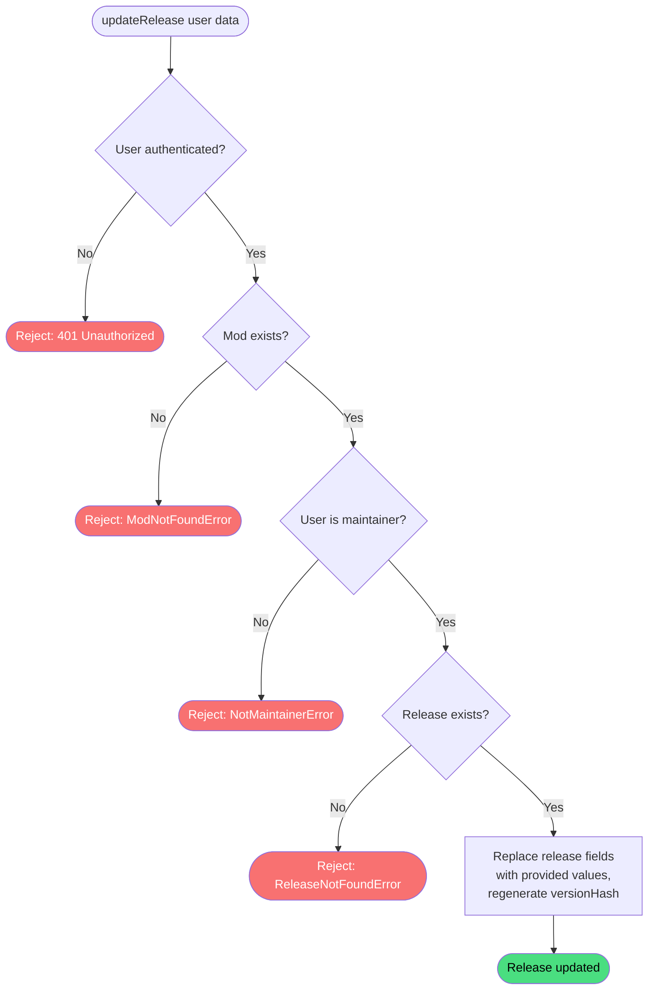

# Update release

**Stable**

Updating a [release](#) replaces the release's stored fields with the values provided by the maintainer. This is how maintainers add [assets](#), [symbolic links](#), and [mission scripts](#) to a release, and how they change its version string, changelog, or visibility. Every update regenerates the release's `versionHash`, which signals to installed [Daemons](#) that a new version is available.

| Property      | Value                                                            |
|---------------|------------------------------------------------------------------|
| Applies to    | Webapp                                                           |
| Trigger       | An authenticated maintainer submits the edit release form        |
| Preconditions | The user is authenticated and is a maintainer of the mod         |

## Inputs

`id`
:   **String, required.** The identifier of the release to update.

`modId`
:   **String, required.** The identifier of the mod the release belongs to.

`version`
:   **String, required.** The version string for the release.

`changelog`
:   **String, required.** Description of changes in this release.

`assets`
:   **List, required.** The downloadable assets for this release. Each asset has a name, one or more download URLs, and a flag indicating whether it is an archive to be extracted after download.

`symbolicLinks`
:   **List, required.** The symlink definitions for this release. Each definition specifies a source path within the extracted asset, a destination path, and which DCS World root directory the destination is relative to (`saved_games` or `dcs_install`).

`missionScripts`
:   **List, required.** Mission script definitions bundled with the release. Each definition specifies a script path, its placement root, and when it should run (`before_sanitize` or `after_sanitize`).

`visibility`
:   **Enum, required.** Controls who can see this release. One of `PUBLIC`, `PRIVATE`, or `UNLISTED`.

### Assertions

| Assertion | Status |
|-----------|--------|
| The user must be authenticated | <Badge type="tip" text="Implemented" /> |
| The mod must exist in the registry | <Badge type="tip" text="Implemented" /> |
| The authenticated user must be a maintainer of the mod | <Badge type="tip" text="Implemented" /> |
| The release must exist in the registry | <Badge type="tip" text="Implemented" /> |

### Outputs

`Result<ModReleaseData, ModNotFoundError | ReleaseNotFoundError | NotMaintainerError>`
:   On success, returns the updated release record. On failure, returns one of the following error types:

`ModNotFoundError`
:   The mod does not exist in the registry.

`NotMaintainerError`
:   The authenticated user is not a maintainer of the mod.

`ReleaseNotFoundError`
:   The release does not exist in the registry.

### Effects

| Effect | Status |
|--------|--------|
| The release's fields are replaced with the provided values | <Badge type="tip" text="Implemented" /> |
| A new `versionHash` is generated and stored with the release | <Badge type="tip" text="Implemented" /> |

> **Note:** The `versionHash` is regenerated on every update. The [Daemon](#) uses this value to detect whether an installed release is out of date. Updating a release — even with no content changes — will cause installed Daemons to see the release as updated.

## Behavior

## See Also

- [Create release](/webapp/spec/create-release) — Spec page for creating the release before it can be updated.
- [Delete release](/webapp/spec/delete-release) — Spec page for removing a release from the registry.
- [Add Release](/daemon/spec/add-release) — Spec page for the Daemon behavior that uses the release's assets and symlink definitions.
- [How the Webapp works](/guides/how-the-webapp-works) — Guide covering release assets, symbolic link definitions, and mission scripts.
